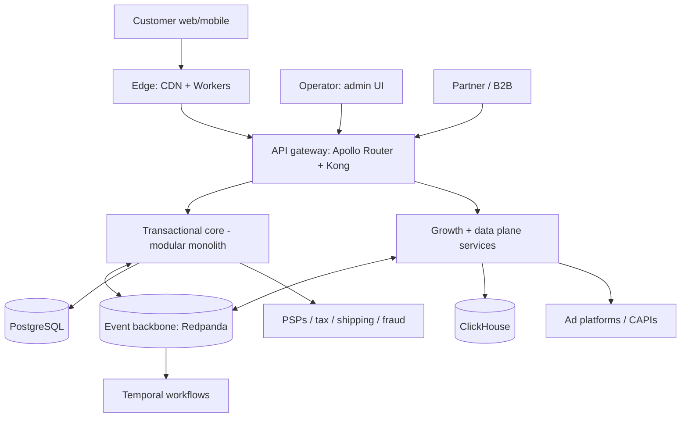

# 01 — Overview and technology

> **Status: CONTRACT — 2026-06-28.** Establishes the system context, the runtime container view,
> and the technology decisions for the whole platform.

## 1. System context

Actors: **Customer** (parent/gift-giver, web + mobile web), **Operator** (admin staff via the
frozen admin UI), **Partner** (schools/B2B, integrations), **Ad/marketing platforms**
(Google, Meta, TikTok, Pinterest), **PSPs/3rd parties** (Stripe, Adyen, tax, shipping, fraud).

## 2. Container view (logical)

| Layer | Containers | Notes |
|---|---|---|
| Edge | Cloudflare CDN, Workers, WAF/Bot | TLS, caching, A/B assignment, tracking beacon |
| Presentation | Storefront (Next.js 15 RSC), Admin (React+Vite — UI frozen), Mobile web | Headless clients |
| Gateway | Apollo Router (GraphQL federation), Kong (REST/gRPC) | Auth, rate limit, composition |
| Core (modular monolith) | catalog, inventory, pricing, cart, checkout, orders, payments, identity, content | One deployable, strict module boundaries |
| Growth/data services | tracking-collector, attribution, analytics, feed-engine, marketing, automation, search, recommendations, notifications, media | Independent scaling |
| Integration | Temporal (orchestration), Debezium (CDC/outbox), Schema Registry (Apicurio) | |
| Data | PostgreSQL 16, Redis, ClickHouse, OpenSearch, S3/R2, pgvector | Per-context ownership |
| Platform | Kubernetes (EKS), Terraform, ArgoCD, Vault, OpenTelemetry/Grafana, Sentry | |

## 3. Technology decisions

Each choice is justified by a requirement, not novelty. Changing a row requires an ADR.

| Concern | Choice | Why (vs. the alternative) |
|---|---|---|
| Storefront | Next.js 15 (App Router, RSC) | Core Web Vitals → ad quality score + SEO; edge ISR with tag purge. Not Hydrogen (Shopify lock-in is what we escape). |
| Admin | React + Vite (UI frozen, see `../ui/`) | Operator tool; fast build; renders the frozen prototype 1:1. |
| App services | NestJS (Node/TS) | DI container maps cleanly to clean architecture; mature ecosystem (GraphQL, gRPC, OpenAPI). |
| High-throughput services | Go | tracking-collector, attribution, inventory reservation, feed-engine, search ingestion — I/O-bound, 50k+ rps; goroutines beat the Node event loop. |
| ML services | Python (FastAPI) | Recommendations, semantic search, SKU age-tier classification — the ML ecosystem is Python. |
| OLTP | PostgreSQL 16 | ACID for orders/inventory; JSONB for flexible per-category attributes; partitioning; logical replication. |
| Cache / sessions / light queue | Redis (Cluster) + BullMQ | Cart state, sessions, rate limiting, distributed locks, lightweight background jobs. |
| Analytics store | ClickHouse | Sub-second aggregation over billions of events; superior real-time ingest/cost vs. BigQuery/Snowflake at our scale. |
| Search | OpenSearch | Faceted search with age-band/learning-outcome facets, custom analyzers; first-party (vs. Algolia vendor lock). |
| Vector | pgvector | Semantic search without a separate vector DB until > ~50M embeddings. |
| Object storage | S3 / Cloudflare R2 | Media + exports + cold analytics; R2 egress-free at scale. |
| Event backbone | Redpanda (Kafka API) | Kafka semantics without ZooKeeper/JVM; log retention + replay (required for attribution recompute). |
| Schema registry | Apicurio | Avro/Protobuf enforced at produce time; consumer-driven evolution. |
| Orchestration | Temporal | Durable long-running workflows (checkout, returns, fulfillment, renewals) with timers/retries. |
| CDC | Debezium | Streams the transactional outbox to Redpanda for exactly-once DB↔broker. |
| Edge compute | Cloudflare Workers | A/B assignment + tracking beacon + geo routing < 50ms p99. |
| Gateway | Apollo Router + Kong | GraphQL federation (Rust, low overhead) + REST/gRPC gateway. |
| AuthN/Z | Ory (Kratos/Hydra) + Keto/OpenFGA | Self-hosted, no per-MAU wall, first-party, Zanzibar ReBAC. (Auth0 acceptable interim.) |
| Payments | Stripe + Adyen (multi-PSP) + tokenization vault | PSP redundancy + dynamic routing; we keep portability. |
| Observability | OpenTelemetry → Grafana/Prometheus/Loki/Tempo + Sentry | Vendor-neutral; own our telemetry. |
| Infra | Kubernetes (EKS) + Terraform + ArgoCD + Vault | Standard cloud-native; boring on purpose. |

## 4. Runtime topology principles

- Stateless services scale horizontally behind the gateway; all session/cart state is in Redis or signed tokens, never in pod memory.
- Reads for customer-facing browse/search are served from read models (OpenSearch/Redis/edge), never the OLTP primary.
- The event backbone is the integration spine; synchronous calls are minimized and never cross a transaction boundary.

## Requires ADR to change

- Any technology row in §3.
- Promoting a core module to its own service (extraction) — record the trigger and the new boundary.
