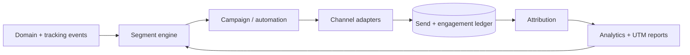

# 08 — Marketing Core architecture

> **Status: CONTRACT — 2026-06-28.** Defines the marketing capability: campaigns, segments,
> lifecycle automation, and how it relates to tracking/analytics/feeds. Surfaces in the frozen
> admin under Marketing, Email, WhatsApp, Automations, Discounts, Coupons.

## 1. Responsibilities

Plan, target, deliver, and measure outbound marketing across channels — without owning the raw
tracking pipeline (doc 09) or the analytics store (doc 10), which it consumes.

## 2. Building blocks

| Block | Description |
|---|---|
| Segments | Audience definitions over customer + behavioral attributes (declarative rule DSL, evaluated against the analytics/identity read models) |
| Campaigns | A channel-typed send (base campaign + channel-specific payload): Email, WhatsApp, SMS, push |
| Lifecycle automations | Event-triggered, multi-step journeys (Temporal-backed) — welcome, abandoned-cart, post-purchase, win-back |
| Lifecycle stages | Household stages: expecting → newborn → toddler → pre-K → early-elementary → lapsed; age-up driven by consented child birthdays |
| Consent | Channel + jurisdiction consent gate checked before every send |

## 3. Channel architecture

Channels are **pluggable adapters** behind a `MessageChannel` port (doc 11). Email (SendGrid/Postmark),
WhatsApp (Cloud API, approved templates only), SMS/push (Twilio/FCM). Adding a channel is a plugin,
not a core change. Sends are async jobs (BullMQ) with per-recipient delivery/engagement ledger.

## 4. Automation engine

- Triggered by domain events (e.g. `cart.abandoned`, `order.delivered`, `customer.registered`).
- Each automation is a **Temporal workflow**: durable steps, delays/timers, branching, exit conditions, A/B branches.
- Automations are **config, not code** — editable in the admin Automations screen; new automations require no deploy.

## 5. Data flow and measurement

- Campaign performance and attribution come from the analytics/attribution contexts (doc 09/10), closing the loop back into segmentation.
- **Reverse-ETL** syncs computed segments to ad platforms and ESPs (doc 10/11).

## 6. Consent and child-safety

No marketing personalization uses children's data. All sends are consent-gated per channel and
jurisdiction; unsubscribes propagate immediately across channels.

## Requires ADR to change

- The segment DSL ownership, the Temporal-backed automation model, or the "automations are config" rule.
- Making any channel non-pluggable (it must remain an adapter/plugin).
