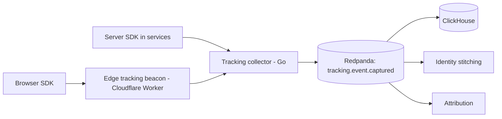

# 09 — Tracking and server-side tracking

> **Status: CONTRACT — 2026-06-28.** Defines first-party event capture (client + server) and the
> server-side tracking / conversions-API pipeline. This is a core differentiator: we own the data.

## 1. Principles

1. **First-party, owned data.** All raw events land in our stores (ClickHouse + buffer); vendors receive derived, consented, hashed conversions — never our raw stream.
2. **One schema, many emitters.** A single versioned event schema (in `packages/tracking/schema`) is used by browser, server, and edge. Validated at the SDK and re-validated at ingest.
3. **Consent-first.** No event is collected or forwarded beyond what the visitor's consent allows; children's behavior is never profiled.
4. **Resilient to cookie/ITP loss.** First-party edge collection + server-side forwarding survive iOS/ITP and third-party cookie deprecation.

## 2. Capture architecture

| Component | Role |
|---|---|
| Browser SDK (`packages/tracking/client`) | Typed `track()`/`identify()`; batches; respects consent; first-party endpoint |
| Edge beacon (`edge/tracking-beacon`) | First-party collection point at the CDN edge; cookieless-friendly; sets first-party ids |
| Server SDK (`packages/tracking/server`) | Emits authoritative server events (orders, payments) — not spoofable |
| Tracking collector (Go) | High-throughput validate → enrich → publish to Redpanda |
| Identity stitching | Maintains the anonymous↔known edge graph (anonymous_id ↔ email_hash ↔ user_id ↔ device_id ↔ household_id) |

## 3. Event schema and governance

- Schema registry (`event_definitions`, versioned JSON Schema / Avro). Every event has a name + version; unknown/invalid events are dead-lettered, not silently dropped.
- Additive-only evolution; deprecations tracked; the SDK refuses to send undeclared events.

## 4. Server-side tracking (conversions APIs)

Outbound, first-party, consented forwarding to ad platforms — the authoritative measurement path:

| Destination | Mechanism |
|---|---|
| Meta | Conversions API (CAPI), hashed PII |
| Google | Enhanced Conversions / offline conversion import |
| TikTok | Events API |
| Pinterest | Conversions API |

- Forwarded from the **server**, using our hashed first-party PII, with event de-duplication keys shared with any client pixel (so platform dedupe works).
- **Offline conversions** (B2B/school deals closed by a rep) are uploaded through the same path.
- Each destination is a **pluggable adapter** (doc 11); adding a platform is a plugin.
- All forwarding is consent-gated and logged for audit.

## 5. Privacy and child-safety

- Consent state travels with the event; non-consented categories are dropped at the edge/collector.
- Children's profiles are never linked into the tracking graph; no behavioral profiling of minors.
- PII is hashed before any third-party forward; raw PII never leaves our boundary.
- Retention is capped (see doc 10) and erasure is honored (cryptographic erase + downstream purge).

## Requires ADR to change

- The "first-party owned raw data" principle or sending raw events to a vendor.
- The single-schema/registry rule, or making CAPI destinations non-pluggable.
