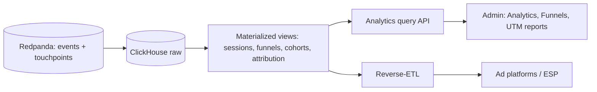
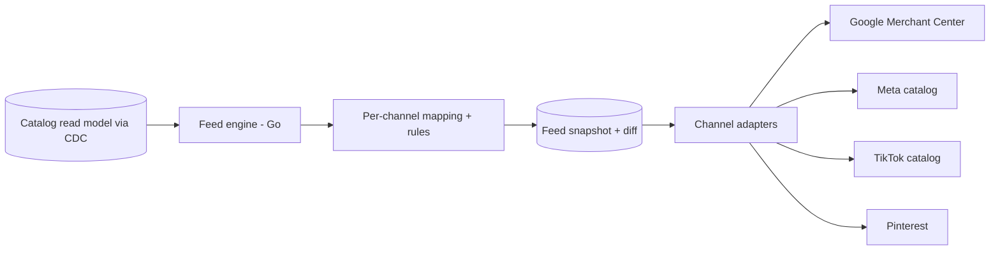

# 10 — Analytics and Feed Engine

> **Status: CONTRACT — 2026-06-28.** Two related data-plane capabilities: the analytics pipeline
> (measurement) and the feed engine (product feeds to ad/shopping platforms).

---

# Part A — Analytics architecture

## A1. Pipeline

## A2. Store and modeling

- **ClickHouse** is the analytics system of record: a wide `events` table partitioned by month, sorted for funnel/cohort scans. A PostgreSQL buffer + schema registry governs definitions (doc 03/09).
- **Materialized views** precompute sessions, daily funnels, retention cohorts, experiment exposures/conversions, and attribution paths — reports never recompute heavy aggregates on read.

## A3. Capabilities

- Self-serve **funnel builder, cohort builder, retention curves** over ClickHouse, queryable by non-engineers (powers the frozen admin Analytics/Funnels screens).
- **Attribution models** are configurable per use case: last-click (finance), time-decay (paid-media), Markov/Shapley (strategic budget). Credit is precomputed per model into the journey read model. Configurable windows per channel (paid social 28d, organic 90d, email 7d).
- **UTM reports** read first-party attribution (doc 09) — surfaced in the frozen admin UTM screen.
- **Replay:** because the event log is retained, models can be recomputed over history.

## A4. Governance and retention

- Every event validated against the versioned schema registry; no schema-less ingestion.
- Retention: raw events ~25 months, aggregates indefinite; consent and erasure honored downstream.
- **We do not use Amplitude/Mixpanel** as the system of record — first-party ownership is the requirement.

---

# Part B — Feed Engine architecture

## B1. Purpose

Generate and sync **product feeds** to shopping/ad platforms from the catalog read model, with the
rich educational-toy attributes (age band, learning outcomes, safety certs) mapped per channel.

## B2. Architecture

| Component | Role |
|---|---|
| Source | Catalog read model, kept fresh via CDC events (`catalog.product.updated`) |
| Mapping | Declarative per-channel field mapping + transformation rules (config, not code) |
| Snapshot + diff | Each run produces a snapshot; only diffs are pushed (incremental sync) |
| Validation | Channel-specific validation (required fields, taxonomies, image rules) before push; failures reported, not silently dropped |
| Adapters | One pluggable adapter per channel (doc 11) |
| Scheduling | Full rebuild on schedule (Temporal cron) + near-real-time delta on catalog events |

## B3. Rules

- Feed definitions, mappings, and channel rules are **config-driven** and editable without deploy.
- Availability/price come from inventory/pricing read models so feeds never advertise out-of-stock or stale prices.
- Each channel adapter is a plugin; adding a marketplace is additive.

## Requires ADR to change

- ClickHouse as the analytics system of record, the schema-registry-enforced ingestion, or first-party ownership.
- The feed-engine source-of-truth (catalog read model via CDC), the diff-based sync, or pluggable channel adapters.
