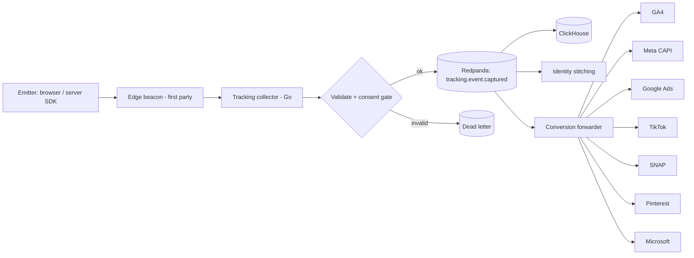

# 16 — Tracking specification

> **Status: CONTRACT — 2026-06-28.** The single source of truth for **all** tracking
> (analytics + marketing clickstream). Extends [09 — tracking and server-side tracking](09-tracking-and-server-side-tracking.md).
> This document governs *analytics/marketing events* (clickstream → ClickHouse + ad platforms).
> *Domain/system events* (inter-service Kafka topics) are in [20 — events catalog](20-events-catalog.md).
> No application code — schemas are expressed as field tables and example payloads.

---

## 1. Event envelope (applies to every event)

Every tracked event — client, edge, or server — shares one envelope. Per-event specs below define
only the **event-specific payload** on top of this.

| Field | Type | Notes |
|---|---|---|
| `event_id` | uuid (v7) | Unique per event occurrence. See §3. |
| `event_name` | string | snake_case; from this catalog only |
| `event_version` | int | schema version; additive evolution only |
| `dedup_id` | string | Shared with the pixel/CAPI pair. See §4. |
| `timestamp` | ISO-8601 (ms, UTC) | client time + server `received_at` both kept |
| `source` | enum | `web` \| `mobile_web` \| `server` \| `edge` |
| `consent` | object | snapshot of consent at emit time (§5) |
| `context.page` | object | Page properties (§6.2) |
| `context.user` | object | User properties (§6.1) |
| `context.session` | object | `session_id`, `visitor_id`, `journey_id` (see [17](17-attribution-specification.md)) |
| `context.device` | object | ua, device_type, os, browser, viewport, locale |
| `context.marketing` | object | UTM + click IDs (§6.4) |
| `properties` | object | Event-specific payload (per-event below) |

## 2. Conventions

- **Naming:** `snake_case`, object_action (`product_viewed`, `checkout_started`). One canonical internal name per event; platform names live only in the mapping matrix (§8).
- **One schema, many emitters:** the same schema (`packages/tracking/schema`) validates browser, server, and edge. Validated at SDK and re-validated at ingest; invalid events are dead-lettered, never silently dropped.
- **Versioned:** every event carries `event_version`; breaking change ⇒ new version, old kept for N=3.

## 3. Event ID strategy

- `event_id` = **UUIDv7** generated at emit (time-ordered, unique per occurrence).
- For events that exist on **both** client and server (purchase, add_to_cart, etc.), the client and server use the **same `dedup_id`** so downstream platforms de-duplicate (§4).
- Server is authoritative for monetary events (purchase, refund); the client copy is best-effort/redundant.

## 4. Deduplication strategy

- **Cross-emitter dedup (pixel ↔ CAPI):** a deterministic `dedup_id` is shared between the browser pixel and the server-side forward. Formula: `dedup_id = hash(event_name + natural_key + bucket)` where `natural_key` is the order id (purchase/refund), cart-line id (add_to_cart), or `session_id + event_name + minute` (views). This is passed to each platform as its dedup field (Meta `event_id`, GA4 dedup, TikTok `event_id`, etc.).
- **Ingest idempotency:** the collector treats `event_id` as the idempotency key; replays are no-ops.
- **Dedup window:** 7 days (matches platform CAPI windows).

## 5. Consent requirements

Consent categories (Consent Mode v2 aligned): `necessary`, `analytics_storage`, `ad_storage`,
`ad_user_data`, `ad_personalization`, `personalization`.

| Consent tier | Meaning | What may fire |
|---|---|---|
| `necessary` | always allowed | core system/security events; no marketing forward |
| `analytics` | analytics_storage granted | first-party analytics ingest (ClickHouse) |
| `marketing` | ad_storage + ad_user_data granted | server-side forward to ad platforms (CAPI) |
| `personalization` | personalization granted | personalization/recommendation signals |

- Consent state is **snapshotted into every event**. The collector/forwarder drops categories not consented (e.g., no CAPI forward without `marketing`).
- **Consent Mode:** when ad consent is denied, ad platforms receive **consent signals only** (cookieless pings) per Consent Mode v2 — never user data. See [17 §9](17-attribution-specification.md).
- **Child safety (overrides all):** no event linked to a child profile is ever collected for analytics or forwarded for marketing. No behavioral profiling of minors. See [14 — security](14-security.md).

## 6. Shared property dictionaries

### 6.1 User properties (`context.user`)
| Field | Notes |
|---|---|
| `visitor_id` | first-party anonymous id (durable) |
| `client_id` | GA-style client id (per browser) |
| `customer_id` | set when authenticated |
| `household_id` | set when known |
| `lifecycle_stage` | expecting…lapsed (marketing) |
| `is_logged_in` | boolean |
| `email_hash`,`phone_hash` | SHA-256, **only** when marketing consent granted; used for CAPI/Enhanced Conversions |

### 6.2 Page properties (`context.page`)
`url`, `path`, `referrer`, `title`, `page_type` (home/collection/product/cart/checkout/…),
`canonical`, `locale`, `currency`.

### 6.3 Product properties (`item` schema — used by all product/cart/checkout/purchase events)
| Field | Notes |
|---|---|
| `item_id` | variant SKU (maps to GMC `id`) |
| `item_group_id` | parent product id |
| `item_name`, `item_brand`, `item_category` | catalog fields |
| `price`, `currency`, `discount` | money |
| `quantity` | line qty |
| `variant` | e.g. "blue / large" |
| `index`, `item_list_id`, `item_list_name` | list position/context |
| `age_min_months`,`age_max_months`,`learning_outcomes` | educational-toy attributes (our differentiator; passed as custom dimensions) |

### 6.4 UTM parameters and click IDs (`context.marketing`)
UTM: `utm_source`, `utm_medium`, `utm_campaign`, `utm_term`, `utm_content`, plus `utm_id`,
`utm_source_platform`, `utm_creative_format`.
Click IDs (captured + persisted, see [17](17-attribution-specification.md)): `gclid`, `gbraid`,
`wbraid`, `fbclid`, `ttclid`, `msclkid`, `scclid`, `twclid`, `li_fat_id`, `epik` (Pinterest).

## 7. Server-side flow (shared)



Steps: emit → first-party edge beacon → collector validates against schema + applies consent gate
→ publish to Redpanda → fan-out to ClickHouse (analytics), identity stitching, and the
conversion forwarder (server-side, hashed PII, shared `dedup_id`). Forwarding result is recorded
as `conversion_forwarded` ([20](20-events-catalog.md)).

## 8. Platform mapping matrix

Every event's mapping to all destinations, in one place ("—" = send as custom event / not standard).
GA4 names are reserved-event names; Meta = CAPI standard events; others are each platform's standard.

| Our event | GA4 | Meta CAPI | Google Ads | TikTok | Snapchat | Pinterest | Microsoft Ads |
|---|---|---|---|---|---|---|---|
| page_view | page_view | PageView | page_view | Pageview | PAGE_VIEW | page_visit | page_view |
| product_viewed | view_item | ViewContent | view_item (DR) | ViewContent | VIEW_CONTENT | page_visit | view_item |
| product_clicked | select_item | — | — | ClickButton | — | — | — |
| collection_viewed | view_item_list | ViewContent | — | ViewContent | VIEW_CONTENT | view_category | — |
| product_list_clicked | select_item | — | — | ClickButton | — | — | — |
| search_submitted | search | Search | — | Search | SEARCH | search | search |
| search_results_viewed | view_search_results | — | — | — | — | — | — |
| product_added_to_wishlist | add_to_wishlist | AddToWishlist | — | AddToWishlist | ADD_TO_WISHLIST | — | — |
| product_added_to_cart | add_to_cart | AddToCart | add_to_cart | AddToCart | ADD_CART | add_to_cart | add_to_cart |
| product_removed_from_cart | remove_from_cart | — | — | — | — | — | — |
| cart_viewed | view_cart | — | — | — | — | — | — |
| checkout_started | begin_checkout | InitiateCheckout | begin_checkout | InitiateCheckout | START_CHECKOUT | — | begin_checkout |
| checkout_shipping_added | add_shipping_info | — | — | — | — | — | — |
| checkout_payment_added | add_payment_info | AddPaymentInfo | — | AddPaymentInfo | ADD_BILLING | — | — |
| purchase_completed | purchase | Purchase | purchase (conv) | CompletePayment | PURCHASE | checkout | purchase |
| order_refunded | refund | — | — | — | — | — | — |
| account_created | sign_up | CompleteRegistration | sign_up | CompleteRegistration | SIGN_UP | signup | sign_up |
| session_started (login) | login | — | — | — | LOGIN | — | — |
| newsletter_subscribed | generate_lead | Lead | — | Subscribe | SUBSCRIBE | lead | — |
| offer_claimed | select_promotion | — | — | — | — | — | — |

Events not in this matrix (page_engagement, filters/sorts, popups, consent_updated, admin/system
events) are **first-party analytics only** — never forwarded to ad platforms.

## 9. Validation rules (global)

- Required envelope fields present; `event_name` ∈ catalog; `event_version` known.
- Monetary events require `value` + `currency` (ISO-4217) and a non-empty `items[]`.
- `items[].item_id` must be a known SKU; `price`/`quantity` ≥ 0.
- Marketing forward requires the relevant consent tier; PII fields must be hashed.
- `dedup_id` present on any event that has a client+server pair.
- Failing validation → DLQ + alert (never dropped silently).

## 10. Event catalog

Per-event spec. Global fields (user/page/device/marketing props, event_id, server flow, platform
mapping in §8, global validation) are **not repeated**; only event-specific details are listed.
`Src` = authoritative source. `Consent` = minimum tier for ingest (marketing forward always needs `marketing`).

### 10.1 Page events
| Event | Purpose | Trigger | Required props | Optional props | Src | Consent |
|---|---|---|---|---|---|---|
| `page_view` | Base traffic + funnel entry | Route render / history change | `page.path`,`page.type` | `referrer` | web/edge | analytics |
| `page_engagement` | Engaged-session + scroll/time quality | Scroll ≥ 50% or ≥ 10s active | `engagement_time_msec` | `scroll_depth` | web | analytics |

### 10.2 Product events
| Event | Purpose | Trigger | Required props | Optional props | Src | Consent |
|---|---|---|---|---|---|---|
| `product_viewed` | PDP demand / remarketing seed | PDP render | `items[1]`,`value`,`currency` | `list_context` | web | analytics |
| `product_clicked` | List → PDP CTR | Click product in a list | `items[1]`,`item_list_id`,`index` | — | web | analytics |
| `product_variant_selected` | Variant interest | Variant chosen on PDP | `item_id`,`variant` | — | web | analytics |
| `product_added_to_wishlist` | Intent / registry | Click wishlist | `items[1]` | `wishlist_id` | web | analytics |
| `product_removed_from_wishlist` | Intent change | Remove from wishlist | `item_id` | — | web | analytics |
| `product_shared` | Virality | Share action | `item_id`,`method` | — | web | analytics |

### 10.3 Collection events
| Event | Purpose | Trigger | Required props | Optional props | Src | Consent |
|---|---|---|---|---|---|---|
| `collection_viewed` | Merch performance | Collection/PLP render | `item_list_id`,`item_list_name`,`items[]` | filters applied | web | analytics |
| `collection_filtered` | Facet usage (age band, outcomes) | Apply filter | `filter_type`,`filter_value` | result_count | web | analytics |
| `collection_sorted` | Sort usage | Change sort | `sort_by` | — | web | analytics |
| `product_list_clicked` | PLP CTR | Click in PLP | `items[1]`,`index`,`item_list_id` | — | web | analytics |

### 10.4 Search events
| Event | Purpose | Trigger | Required props | Optional props | Src | Consent |
|---|---|---|---|---|---|---|
| `search_submitted` | Demand signals | Submit query | `search_term` | `search_type` | web | analytics |
| `search_results_viewed` | Result quality | Results render | `search_term`,`result_count` | `items[]` | web | analytics |
| `search_result_clicked` | Relevance | Click a result | `search_term`,`item_id`,`index` | — | web | analytics |
| `search_no_results` | Catalog gaps | Zero results | `search_term` | — | web | analytics |

### 10.5 Cart events
| Event | Purpose | Trigger | Required props | Optional props | Src | Consent | Dedup key |
|---|---|---|---|---|---|---|---|
| `product_added_to_cart` | Core micro-conversion | Add to cart | `items[1]`,`value`,`currency` | `cart_id` | web (+server mirror) | analytics | cart_line_id |
| `product_removed_from_cart` | Friction | Remove line | `items[1]` | — | web | analytics | — |
| `cart_quantity_updated` | Intent change | Qty change | `item_id`,`quantity` | — | web | analytics | — |
| `cart_viewed` | Cart funnel | Cart/drawer open | `items[]`,`value` | — | web | analytics | — |
| `discount_code_applied` | Promo effectiveness | Apply code | `coupon`,`value_delta` | — | web | analytics | — |
| `discount_code_denied` | Promo friction | Invalid code | `coupon`,`reason` | — | web | analytics | — |

### 10.6 Checkout events
| Event | Purpose | Trigger | Required props | Optional props | Src | Consent |
|---|---|---|---|---|---|---|
| `checkout_started` | Funnel top | Enter checkout | `items[]`,`value`,`currency` | `coupon` | web (+server) | analytics |
| `checkout_contact_added` | Step completion | Contact submitted | `checkout_id` | — | web | analytics |
| `checkout_shipping_added` | Step completion | Shipping chosen | `shipping_tier` | — | web | analytics |
| `checkout_payment_added` | Step completion | Payment entered | `payment_type` | — | web | analytics |
| `checkout_step_completed` | Generic step tracking | Any step done | `step`,`step_name` | — | web | analytics |
| `checkout_error` | Friction/loss | Validation/payment error | `error_code`,`step` | — | web/server | analytics |

### 10.7 Purchase events
| Event | Purpose | Trigger | Required props | Optional props | Src | Consent | Dedup key |
|---|---|---|---|---|---|---|---|
| `purchase_completed` | Primary conversion + revenue | Order paid | `transaction_id`,`value`,`currency`,`items[]` | `tax`,`shipping`,`coupon` | **server** (client mirror) | analytics; forward needs marketing | transaction_id |
| `order_refunded` | Net revenue accuracy | Refund issued | `transaction_id`,`value`,`currency` | `items[]` | server | analytics | transaction_id+refund |
| `subscription_started` | Recurring revenue | Subscription created | `transaction_id`,`value`,`plan` | — | server | analytics | subscription_id |

### 10.8 Customer events
| Event | Purpose | Trigger | Required props | Optional props | Src | Consent |
|---|---|---|---|---|---|---|
| `account_created` | Acquisition | Sign-up complete | `method` | `referral` | server | analytics |
| `session_started` | Login / returning | Successful login | `method` | — | server | necessary |
| `logged_out` | Session end | Logout | — | — | server | necessary |
| `profile_updated` | Data quality | Profile saved | `fields_changed` | — | server | analytics |
| `newsletter_subscribed` | Lead capture | Opt-in | `list`,`source` | — | web/server | marketing |
| `consent_updated` | Compliance audit | Consent change | `consent` (full) | — | web | necessary |
| `address_added` | Checkout readiness | Address saved | `country` | — | server | analytics |

### 10.9 Marketing events
| Event | Purpose | Trigger | Required props | Src | Consent |
|---|---|---|---|---|---|
| `campaign_landing_viewed` | Landing performance | Landing page w/ UTM | `utm.*`,`landing_id` | web | analytics |
| `offer_viewed` | Offer exposure | Offer shown | `offer_id` | web | analytics |
| `offer_claimed` | Offer conversion | Offer accepted | `offer_id`,`value` | web | analytics |
| `popup_shown` / `popup_dismissed` | Popup effectiveness | Popup show/close | `popup_id` | web | analytics |
| `email_opened` / `email_clicked` | Email engagement | ESP webhook | `campaign_id`,`message_id` | server | marketing |
| `whatsapp_message_delivered` / `_read` | WhatsApp engagement | WA webhook | `campaign_id`,`message_id` | server | marketing |

### 10.10 Admin events (operational/audit — analytics only, never forwarded)
`admin_signed_in`, `product_published`, `price_updated`, `discount_created`, `order_refund_issued`,
`feature_flag_toggled`, `experiment_launched`, `feed_published`, `user_invited`,
`permission_changed`. Required: `actor_id`, `resource_type`, `resource_id`, `action`; mirrored to
the immutable audit log ([14](14-security.md)). Consent: `necessary`.

### 10.11 System events (machine-generated — analytics only)
`reservation_expired`, `inventory_low_detected`, `cart_abandoned_detected`, `experiment_assigned`,
`experiment_exposed`, `feed_sync_completed`, `feed_sync_failed`, `conversion_forwarded`,
`job_failed`. These bridge to the domain event catalog ([20](20-events-catalog.md)).
`experiment_exposed` is the canonical tie-in to [21 — experimentation](21-experimentation-and-cro.md).

## 11. Example payloads

Canonical envelope + `purchase_completed`:

```json
{
  "event_id": "018f9c2a-7b3e-7c41-9b2a-2c1d5e6f7a8b",
  "event_name": "purchase_completed",
  "event_version": 1,
  "dedup_id": "purchase_TS-ORD-1042",
  "timestamp": "2026-06-28T10:14:53.221Z",
  "source": "server",
  "consent": { "analytics": true, "marketing": true, "personalization": false },
  "context": {
    "page": { "path": "/checkout/complete", "page_type": "purchase", "currency": "USD" },
    "user": { "visitor_id": "v_9f...", "client_id": "GA1.2...", "customer_id": "c_8a...",
              "email_hash": "9b74c9...", "lifecycle_stage": "toddler" },
    "session": { "session_id": "s_5d...", "journey_id": "j_77...", "visitor_id": "v_9f..." },
    "device": { "device_type": "mobile", "os": "iOS", "browser": "Safari", "locale": "en-GB" },
    "marketing": { "utm_source": "google", "utm_medium": "cpc",
                   "utm_campaign": "spring-stem-launch", "gclid": "Cj0KCQ..." }
  },
  "properties": {
    "transaction_id": "TS-ORD-1042",
    "value": 84.00, "currency": "USD", "tax": 6.40, "shipping": 4.99, "coupon": "SPRING20",
    "items": [
      { "item_id": "TS-WRS-01", "item_group_id": "WRS", "item_name": "Wooden rainbow stacker",
        "item_brand": "Tiny Scholars", "item_category": "Wooden", "price": 32.00,
        "quantity": 1, "age_min_months": 18, "age_max_months": 60,
        "learning_outcomes": ["fine_motor","spatial_reasoning"] }
    ]
  }
}
```

`product_added_to_cart` (event-specific payload delta):
```json
{ "event_name": "product_added_to_cart", "dedup_id": "atc_cl_3391",
  "properties": { "value": 32.00, "currency": "USD",
    "items": [ { "item_id": "TS-WRS-01", "item_name": "Wooden rainbow stacker",
                 "price": 32.00, "quantity": 1 } ] } }
```

All other events follow the same envelope; their `properties` match the catalog rows in §10.

## Requires ADR to change

- The event envelope, event-ID/dedup strategy, or consent-gating model.
- Adding/removing an event category, or forwarding any event not marked forwardable in §8.
- The "no minor profiling / no child-linked event forwarding" rule.
