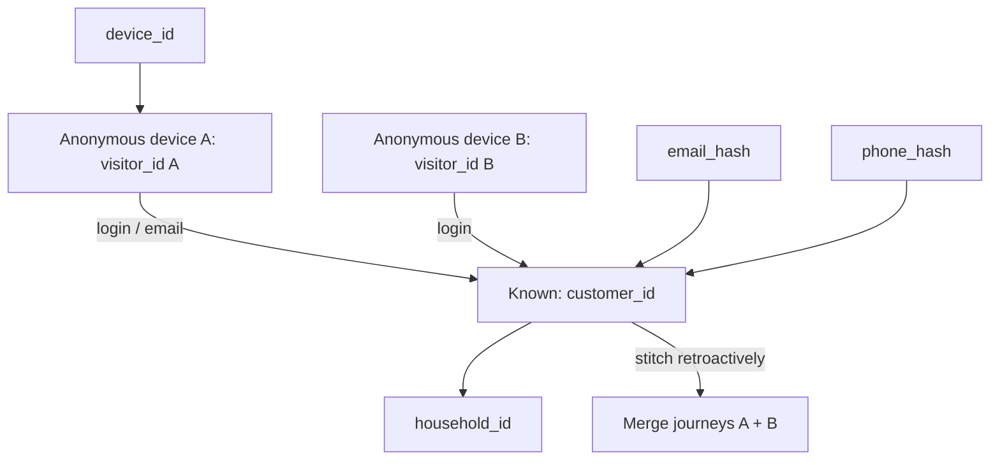
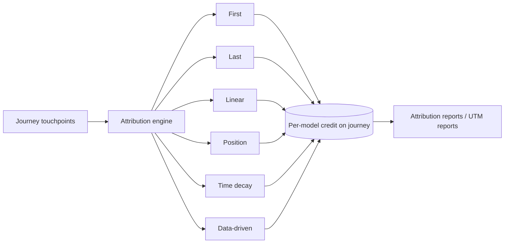

# 17 — Attribution specification

> **Status: CONTRACT — 2026-06-28.** Enterprise attribution design. Extends
> [09 — tracking](09-tracking-and-server-side-tracking.md), [10 — analytics](10-analytics-and-feed-engine.md),
> and consumes the events in [16 — tracking specification](16-tracking-specification.md). No code.

## 1. Goals

Stitch every touch a household has with us — across devices, sessions, anonymous→known, online and
offline — into a journey, then assign conversion credit under multiple models. Last-click is
structurally wrong for a long-consideration purchase (parents research for weeks), so multi-touch
is first-class. All raw data is first-party (ClickHouse), enabling model recompute over history.

## 2. Identifier model

### 2.1 Persisted identifiers

| Identifier | Scope | Lifetime | Storage |
|---|---|---|---|
| `visitor_id` | Anonymous person/browser (first-party) | 13 months, refreshed on activity | first-party cookie + edge + ClickHouse |
| `client_id` | GA-style per-browser id | per browser | cookie |
| `session_id` | One visit (30-min inactivity or UTM change → new) | session | cookie/edge |
| `journey_id` | One consideration cycle (first touch → conversion or expiry) | until conversion or 90-day decay | server |
| `customer_id` | Authenticated person | permanent | identity context |
| `household_id` | Purchasing unit (multiple members/devices) | permanent | identity context |

### 2.2 Click IDs captured and persisted

On any landing with a click ID, it is captured into `context.marketing`, persisted to the
`visitor_id`/`journey_id`, and used for server-side conversion forwarding + Enhanced Conversions:

`gclid`, `gbraid`, `wbraid` (Google), `fbclid` (Meta), `ttclid` (TikTok), `msclkid` (Microsoft),
`scclid` (Snapchat), `twclid` (X/Twitter), `li_fat_id` (LinkedIn), `epik` (Pinterest).

Each click ID is stored with capture timestamp + the source/medium/campaign resolved at capture, so
it survives cookie loss and is available at conversion time for the relevant platform's CAPI.

## 3. Session and journey rules

- **New session** when: 30 min inactivity, calendar-day rollover (configurable), or a new
  `utm_*`/click-id appears (campaign change always starts a session, per GA convention).
- **Journey** spans sessions: opens on first touch, accumulates touchpoints, closes on conversion;
  a new journey opens after a closed one or after 90 days of inactivity (configurable per channel).
- A conversion attributes against the **open journey's** touchpoints.

## 4. Identity resolution (cross-device, returning, anonymous)

- **Edges** (`identity_edges`): `visitor_id ↔ client_id ↔ device_id ↔ email_hash ↔ phone_hash ↔ customer_id ↔ household_id`, each with a confidence score and observed-at time.
- **Anonymous users:** tracked by `visitor_id`; full journey retained pre-identification.
- **Returning visitors:** matched on durable `visitor_id`; on login, anonymous history is **retroactively stitched** to the `customer_id` and merged at the `household_id` (the cross-device case: research on laptop, buy on phone).
- **Deterministic first, probabilistic optional:** deterministic matches (shared login/email) are confidence 1.0; probabilistic matches (device graph) are flagged lower-confidence and excluded from financial reporting.

## 5. Attribution models

All models run over the same stored journey; switching model is a query/config choice, never a
re-collection. Credit is **precomputed per model** into the journey read model ([10](10-analytics-and-feed-engine.md)).

| Model | Credit rule | Primary use |
|---|---|---|
| First touch | 100% to first touchpoint | Demand-gen / awareness valuation |
| Last touch | 100% to last touchpoint | Finance reporting (default ledger) |
| Linear | Equal across all touchpoints | Baseline multi-touch |
| Position-based (U) | 40% first, 40% last, 20% middle | Balanced acquisition + closing |
| Time decay | Exponential, recent > older (configurable half-life) | Paid-media optimization |
| Data-driven (ready) | Shapley / Markov removal-effect | Strategic budget allocation |

"Data-driven ready" = the pipeline stores full paths and exposes Shapley/Markov computation hooks;
the model can be enabled once volume is statistically sufficient, with no schema change.

## 6. Conversion windows

Configurable per channel (defaults): paid social 28d click / 1d view; paid search 30–90d;
organic 90d; email 7d; referral 30d. View-through is tracked separately from click-through and
never mixed in the same credit total.

## 7. Offline conversion import

- B2B/school deals closed by a rep, phone orders, and in-person events are imported and matched to
  the originating `journey_id`/click ID via the captured identifiers.
- Imported conversions flow through the **same** attribution engine and are uploaded to platforms
  via offline conversion import (Google) / CAPI with action source `physical_store`/`other`.

## 8. Enhanced Conversions

- On conversion, hashed first-party PII (`email_hash`, `phone_hash`, name/address hashes) + the
  stored click ID are sent server-side to Google (Enhanced Conversions) and equivalently to Meta/
  TikTok/etc. CAPIs — recovering conversions lost to cookie/ITP gaps.
- Hashing (SHA-256, normalized) happens server-side; raw PII never leaves our boundary.

## 9. Consent Mode and privacy

- **Consent Mode v2:** when `ad_storage`/`ad_user_data` are denied, platforms receive cookieless
  consent pings / modeled signals only — no identifiers. When granted, full server-side forward
  with hashed PII proceeds.
- Click IDs are captured regardless (first-party), but **forwarded only** under marketing consent.
- Children: never attributed, never forwarded ([14](14-security.md)).

## 10. Attribution reporting

- **Surfaces:** the frozen admin **Analytics**, **Funnels**, and **UTM reports** screens (read-only contract — see `../ui/`). No new UI is introduced here.
- **Reports:** channel/source/medium/campaign/creative performance; assisted vs. last-click; path-length and time-to-convert; model comparison (same conversion under each model side by side); new vs. returning; cross-device contribution; ROAS/CAC/LTV joins (see [19](19-marketing-data-model.md)).
- **Truth source:** ClickHouse materialized views; finance uses last-touch as the reconciliation ledger while paid-media optimizes on time-decay/data-driven.

## Requires ADR to change

- The identifier set/lifetimes, the journey/session rules, or the identity-stitching model.
- The set of supported attribution models or the per-channel default windows.
- The Consent Mode behavior or the "click IDs captured first-party, forwarded only on consent" rule.
