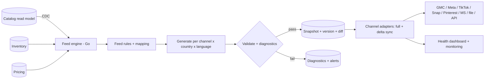

# 18 — Product feed specification

> **Status: CONTRACT — 2026-06-28.** Enterprise Feed Engine design. Extends
> [10 — analytics and feed engine, Part B](10-analytics-and-feed-engine.md). No code.

## 1. Purpose and source of truth

Generate, validate, and sync product feeds to shopping/ad channels from the **catalog read model**
(kept fresh via CDC), enriched with inventory and pricing read models so feeds never advertise
stale price or out-of-stock items. Educational-toy attributes (age band, learning outcomes, safety
certs) are mapped to channel fields and custom labels.

## 2. Channels and formats

| Channel | Primary integration | Formats supported |
|---|---|---|
| Google Merchant Center | Content API + scheduled file | XML (RSS 2.0), JSON, CSV/TSV |
| Meta Commerce Manager | Catalog API + scheduled feed | CSV, XML (RSS/ATOM), JSON |
| TikTok Catalog | Catalog API + file | CSV, XML |
| Snap Catalog | Catalog API + CSV | CSV, XML |
| Pinterest Catalog | API + scheduled feed | CSV, TSV, XML (RSS) |
| Microsoft Merchant Center | Content API + file | TSV, XML |
| Generic export | file/url | CSV, XML, JSON, RSS, **API feed** (pull endpoint) |

**API Feed** = a versioned, paginated, cacheable pull endpoint partners/channels fetch on demand
(in addition to push via each channel's API).

## 3. Architecture

## 4. Feed generation

- **Inputs:** catalog products/variants + inventory availability + pricing (incl. sale price/dates).
- **Granularity:** one feed per `channel × country × language` (see §13). A feed definition selects the product set (collection/rules), the field mapping, and the schedule.
- **Variants:** each sellable variant is a feed item with `id` (SKU) + `item_group_id` (parent) so channels group correctly; shared fields inherited from the parent, variant fields (color/size) per item.
- **Output:** the selected format(s); large feeds are chunked/paginated per channel limits.

## 5. Field mapping and required attributes

Declarative, per-channel mapping (config, not code). Core mapped attributes:

| Concept | Feed field (Google baseline) |
|---|---|
| Id / parent | `id`, `item_group_id` |
| Title / description | `title`, `description` |
| Availability / price | `availability`, `price`, `sale_price`, `sale_price_effective_date` |
| Brand / GTIN / MPN | `brand`, `gtin`, `mpn`, `identifier_exists` |
| Category | `google_product_category`, `product_type` (§7) |
| Images | `image_link`, `additional_image_link` (§11) |
| Shipping / tax | `shipping`, `shipping_weight`, `tax` (§9) |
| Custom labels | `custom_label_0..4` (§6) |
| Age (educational) | `age_group` + custom labels for age-band-in-months/learning outcomes |

Channel-specific names (Meta `availability`/`condition`, Pinterest `link`, etc.) are produced by the per-channel mapping profile from the same canonical model.

## 6. Feed rules and custom labels

- **Feed rules:** declarative transforms applied at generation — include/exclude (e.g. exclude `draft`/0-stock), set/override fields, derive values, regex replace, default-if-missing, currency/locale formatting. Replayable and versioned with the feed definition.
- **Custom labels (`custom_label_0..4`):** strategy dimensions for bidding/segmentation — e.g. margin tier, best-seller, seasonal, age band, learning outcome, clearance. Defined per channel as rules.

## 7. Google Product Category

- Maintained mapping from our `catalog.category` taxonomy → Google Product Taxonomy IDs, plus a free-form `product_type` reflecting our own hierarchy. Unmapped categories raise a diagnostic and block only the affected items, not the whole feed.

## 8. Inventory and price sync

- **Inventory sync:** availability is driven by the inventory read model; on `stock.low`/`stock.adjusted`/`stock.depleted` events a **delta sync** updates only affected items (near-real-time), independent of full rebuilds.
- **Price sync:** price/sale-price driven by the pricing read model; promotion start/end (`sale_price_effective_date`) is emitted so channels schedule sale pricing. Price/availability deltas are the highest-priority sync path.

## 9. Shipping and tax

- **Shipping:** per `shipping_zones`/`shipping_rates` ([db design]) mapped to channel `shipping` (country/region/service/price) or account-level shipping settings where the channel prefers that.
- **Tax:** `tax` attribute (US) or tax-inclusive pricing flag per locale, derived from the pricing/tax context; correctness is validated before sync.

## 10. Country and language feeds

- One feed per **country** (currency, price, shipping, availability, tax) and per **language** (translated title/description/attributes from catalog translations).
- Feeds inherit from a canonical product and override only locale-specific fields. Missing translations fall back per policy and raise a diagnostic.

## 11. Images

- `image_link` = primary; `additional_image_link` = gallery; channel-specific size/ratio/format rules validated (min dimensions, no promotional overlays for Google). Images served from the CDN ([media](03-domain-and-database-boundaries.md)). Missing/invalid primary image blocks that item with a diagnostic.

## 12. Validation and diagnostics

- **Validation (pre-sync):** required fields present, types/enums valid (`availability`, `condition`), price > 0, currency matches country, GTIN checksum, image reachable + within size rules, category mapped. Item-level failures isolate the item; feed-level failures block the run.
- **Diagnostics:** per-item error/warning records (code, field, message, suggested fix) + channel-returned disapprovals reconciled back (e.g. GMC item-level issues), surfaced in the health dashboard.

## 13. Scheduling, versioning, retry

- **Scheduling:** full rebuild on a cron (Temporal) per feed (e.g. every 6–24h) + event-driven **delta** on catalog/price/inventory changes (near-real-time).
- **Versioning:** every generation produces an immutable, versioned **snapshot**; sync pushes the **diff** vs. the last successfully-synced snapshot; rollback = re-push a prior snapshot.
- **Retry strategy:** per-channel exponential backoff + jitter, bounded attempts, partial-batch retry (only failed items), DLQ + alert on exhaustion; idempotent upserts keyed by `id`.

## 14. Monitoring and feed health dashboard

Tracked per feed × channel × country: last successful sync, item counts (active/disapproved/
pending/excluded), error/warning counts by code, coverage % (synced vs. eligible), price/stock
freshness lag, sync duration, and channel approval status. Alerts on: sync failure, disapproval
spike, coverage drop, or staleness beyond SLA. (Operational surfacing of this dashboard in the
admin UI is governed by the frozen UI contract — `../ui/` — and requires approval to add a screen.)

## Requires ADR to change

- The catalog-read-model source of truth, the snapshot+diff sync model, or per-channel pluggable adapters.
- Adding a channel/format outside §2, or changing the country/language feed granularity model.
