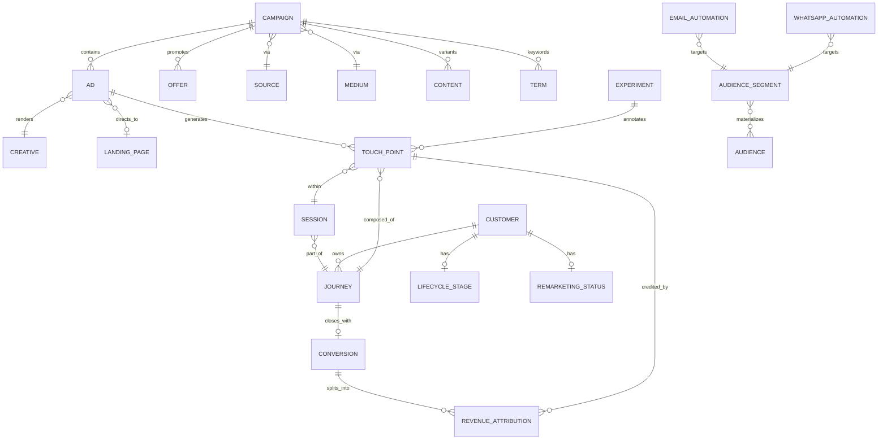

# 19 — Marketing data model

> **Status: CONTRACT — 2026-06-28.** The complete **logical** marketing data model (entities,
> attributes, relationships, metric definitions). This is a logical/conceptual model living in the
> marketing + analytics read models — **not** physical migrations and **not** DDL. References across
> contexts are by id only (no cross-context FK, per [03](03-domain-and-database-boundaries.md)).

## 1. Entity map

## 2. Campaign taxonomy

| Entity | Purpose | Key attributes | Relationships |
|---|---|---|---|
| **Campaign** | A marketing initiative | `campaign_id`, name, objective, channel, status, budget, start/end, `utm_campaign`, `utm_id` | has Ads, Offers; via Source/Medium |
| **Source** | Traffic origin | `source_id`, name (`google`,`meta`,`klaviyo`), platform | referenced by Campaign/TouchPoint |
| **Medium** | Channel type | `medium_id`, name (`cpc`,`email`,`organic`,`paid_social`) | referenced by Campaign/TouchPoint |
| **Content** | Creative/copy variant (utm_content) | `content_id`, label, `utm_content`, variant_of | belongs to Campaign |
| **Term** | Keyword (utm_term) | `term_id`, keyword, match_type | belongs to Campaign |
| **Creative** | The asset rendered | `creative_id`, type (image/video/carousel), asset refs, dimensions | rendered by Ad |
| **Ad** | A placed ad instance | `ad_id`, platform_ad_id, placement, status, click ID type | belongs to Campaign; uses Creative; → LandingPage; generates TouchPoints |
| **Landing Page** | Destination | `landing_id`, url, `page_id` (CMS), conversion_goal, `utm_defaults` | targeted by Ads |
| **Offer** | Promotion presented | `offer_id`, type, value, `discount_rule_id`, validity | promoted by Campaign |

## 3. Journey and measurement

| Entity | Purpose | Key attributes | Relationships |
|---|---|---|---|
| **Session** | One visit | `session_id`, `visitor_id`, started/ended, source/medium/campaign snapshot, device | part of Journey; holds TouchPoints |
| **Journey** | One consideration cycle | `journey_id`, `visitor_id`, `customer_id?`, `household_id?`, first_touch_at, converted_at, touch_count, status | owns TouchPoints; closes with Conversion |
| **Touch Point** | A single marketing interaction | `touchpoint_id`, channel, source/medium/campaign/content/term, click ID, `landing_id`, `ad_id`, occurred_at, position | within Session; in Journey; credited by RevenueAttribution; annotated by Experiment |
| **Conversion** | A goal completion | `conversion_id`, type (purchase/lead/offline), `transaction_id?`, value, currency, occurred_at, source (online/offline) | closes a Journey; splits into RevenueAttribution |
| **Revenue Attribution** | Credit assigned to a touchpoint under a model | `conversion_id`, `touchpoint_id`, `model`, credit_fraction, credited_value | links Conversion ↔ TouchPoint per model (one row per model × touchpoint) |

`Revenue Attribution` is precomputed per model (first/last/linear/position/time-decay/data-driven, see [17](17-attribution-specification.md)); reporting reads it, never recomputes on the fly.

## 4. Audience and lifecycle

| Entity | Purpose | Key attributes |
|---|---|---|
| **Audience** | A concrete targetable list (synced to a channel) | `audience_id`, name, channel, external_id, size, last_synced_at |
| **Audience Segment** | A rule-defined cohort over customer + behavior | `segment_id`, name, definition (rule DSL), is_dynamic, refresh_cadence |
| **Lifecycle Stage** | Household stage | `customer_id`/`household_id`, stage (`expecting`…`lapsed`), since, source |
| **Remarketing Status** | Targetability state | `customer_id`, status (`active`,`suppressed`,`converted`,`do_not_target`), reason, expires_at, consent flags |

Segments materialize into Audiences and are pushed to ad platforms / ESP via reverse-ETL ([10](10-analytics-and-feed-engine.md)). Remarketing status enforces suppression (converted, opted-out, frequency caps) and never targets minors.

## 5. Automation and experiment

| Entity | Purpose | Key attributes |
|---|---|---|
| **Email Automation** | Lifecycle email flow | `automation_id`, name, trigger_event, steps[], `segment_id`, status, exit_conditions |
| **WhatsApp Automation** | Lifecycle WhatsApp flow | `automation_id`, name, trigger_event, template refs, steps[], `segment_id`, status |
| **Experiment** | A/B or personalization test | `experiment_id`, key, hypothesis, variants[], primary_metric, status (see [21](21-experimentation-and-cro.md)) |

Automations are Temporal-backed and config-driven ([08](08-marketing-core.md)); Experiment annotates touchpoints/sessions so marketing performance can be sliced by variant.

## 6. Customer lifetime metrics and KPIs

Computed in the analytics read model (ClickHouse) and joined to attribution for ROI reporting.

| Metric | Definition | Formula (logical) |
|---|---|---|
| **AOV** | Average order value | `total_revenue / order_count` (window-scoped) |
| **LTV** | Customer lifetime value | `sum(net_revenue per customer)`; predictive LTV = `avg_order_value × purchase_frequency × expected_lifespan` (per cohort/segment) |
| **CAC** | Customer acquisition cost | `marketing_spend(channel, period) / new_customers_acquired(channel, period)` |
| **ROAS** | Return on ad spend | `attributed_revenue(model) / ad_spend`; reported per attribution model + channel + campaign |
| **CLV metrics bundle** | Lifetime KPIs per customer/household | first/last order, order_count, lifetime_revenue, AOV, purchase_frequency, recency, predicted_LTV, churn_risk |
| **Payback period** | Time to recover CAC | `CAC / (AOV × gross_margin × purchase_frequency)` |
| **Contribution margin** | Net of COGS + variable cost | `revenue − COGS − fulfillment − payment_fees` |

Conventions: revenue is **net of refunds** (refunds adjust attribution, [16 §10.7](16-tracking-specification.md)); ROAS is always labeled with its attribution model and window; spend is imported per channel (offline import path, [17 §7](17-attribution-specification.md)). Children's data is never an input to any of these metrics.

## Requires ADR to change

- The entity set or the journey→touchpoint→conversion→attribution relational shape.
- The metric definitions/formulas (AOV/LTV/CAC/ROAS), or computing any metric from child data.
