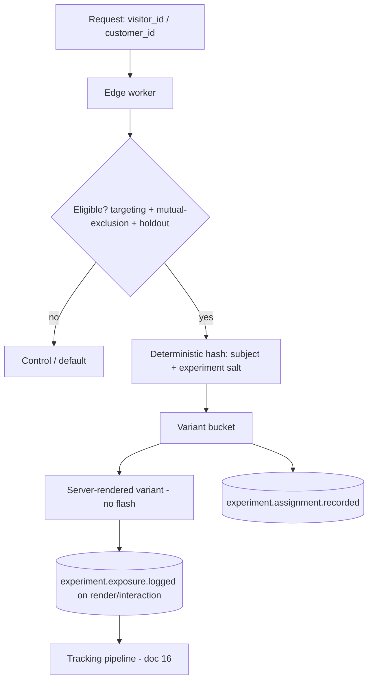

# 21 — Experimentation and CRO

> **Status: CONTRACT — 2026-06-28.** The CRO platform: experimentation, personalization, and the
> conversion modules. Builds on the experimentation context ([03](03-domain-and-database-boundaries.md)),
> feature flags ([12](12-feature-flags-and-configuration.md)), and **integrates fully with
> [16 — tracking specification](16-tracking-specification.md)** (assignment/exposure/metric events).
> No code. CRO modules render on the storefront via the page-builder block registry; any **admin**
> surface uses the existing frozen screens (A/B testing, Feature flags, Upsells, Cross-sells) —
> a new admin screen requires approval (`../ui/`).

## 1. Capabilities

| Capability | Mechanism |
|---|---|
| A/B testing | 2-variant split, deterministic assignment |
| Multivariate (MVT) | Factorial combinations across multiple factors |
| Feature flags | Shared primitive ([12](12-feature-flags-and-configuration.md)); flags and experiments use one assignment engine |
| Personalization | Rule/audience-driven variant selection (not randomized) |
| Audience targeting | Eligibility by segment, lifecycle stage, geo, device, source, new/returning |
| Dynamic content | Content blocks resolved per variant/audience at render |
| CRO modules | Sticky ATC, bundles, upsells, cross-sells, exit intent, countdown, trust badges, recently viewed, FBT, AI recs (§5) |

## 2. Assignment architecture

- **Deterministic, edge-side assignment:** variant = stable hash of `subject_id` + experiment salt → no DB read on the hot path, no flash of original content, works with RSC.
- **Mutual-exclusion groups:** experiments in the same group never overlap for one subject (avoids interaction effects).
- **Holdout group:** a configurable global % permanently excluded from all experiments for long-term lift measurement.
- **Sticky:** same subject → same variant across sessions/devices once identity is stitched ([17](17-attribution-specification.md)).

## 3. Experiment types

| Type | Assignment | Reporting basis |
|---|---|---|
| A/B | Random, weighted | Frequentist sequential or Bayesian (§7) |
| MVT | Random across factor combinations | Per-factor + interaction effects |
| Personalization | Deterministic by audience rule | Lift vs. holdout, not p-value |
| Bandit (low traffic) | Multi-armed bandit reallocates traffic to winners | Posterior-driven |

## 4. Targeting and dynamic content

- **Targeting context:** segment ([19](19-marketing-data-model.md)), lifecycle stage, geo, device, traffic source/UTM, new vs. returning, cart state — evaluated at the edge.
- **Dynamic content:** CMS blocks declare an `experiment_handle` ([12](12-feature-flags-and-configuration.md)/CMS); the resolver picks the variant's content at render. Content variants are config, not deploys.

## 5. CRO module catalog

Each module is a storefront block (page-builder registry) whose visibility/variant can be
experiment- or audience-controlled, and which emits standardized tracking events ([16](16-tracking-specification.md)).

| Module | Purpose | Placement / trigger | Config source | Tracking events |
|---|---|---|---|---|
| Sticky add-to-cart | Keep ATC in view → conversion | PDP scroll past fold | flag/experiment | `product_added_to_cart`, `experiment_exposed` |
| Bundles | Raise AOV via curated sets | PDP / cart | Catalog bundles ([db]) | `offer_viewed`, `product_added_to_cart` |
| Upsells | Higher-value alternative | Post-add / pre-checkout | Catalog relations | `offer_viewed`, `offer_claimed`, `product_added_to_cart` |
| Cross-sells | Complementary items | Cart / PDP | Catalog relations | `offer_viewed`, `product_list_clicked`, `product_added_to_cart` |
| Exit intent | Recover abandoning visitors | Exit-intent / inactivity | flag/experiment + offer | `popup_shown`, `popup_dismissed`, `offer_claimed` |
| Countdown | Urgency on offers | PDP/cart when offer active | Offer validity | `offer_viewed`, `experiment_exposed` |
| Trust badges | Reduce anxiety (safety certs!) | PDP/checkout | Catalog safety certs | `experiment_exposed` |
| Recently viewed | Re-engagement / recovery | PDP/home rail | Social recently_viewed | `product_list_clicked`, `product_viewed` |
| Frequently bought together | Attach rate | PDP/cart | Recommendations | `offer_viewed`, `product_added_to_cart` |
| AI recommendations | Personalized discovery | Home/PDP/cart/search | Recommendations service (Python/FastAPI) | `product_list_clicked`, `product_viewed` |

Recommendations (FBT + AI recs) are served by the recommendations context (collaborative +
content-based, ranked by a learned model); inputs respect consent and **never** use child data.

## 6. Tracking integration (mandatory)

Every experiment and module ties to the tracking spec:

- **Assignment:** `experiment.assignment.recorded` ([20](20-events-catalog.md)) on bucketing.
- **Exposure:** `experiment_exposed` ([16 §10.11](16-tracking-specification.md)) when the variant is actually rendered/seen — exposure (not assignment) is the analysis denominator.
- **Metrics:** outcomes are existing tracking events (`product_added_to_cart`, `checkout_started`, `purchase_completed`, …) joined to the variant in ClickHouse — no bespoke metric pipeline.
- **Stable identity:** analysis keys on `visitor_id`/`customer_id`/`household_id` so cross-device exposure and conversion line up ([17](17-attribution-specification.md)).

## 7. Statistical engine

| Aspect | Decision |
|---|---|
| Frequentist | **Sequential testing with always-valid p-values** → safe continuous peeking without inflated false positives |
| Bayesian | Posterior probability "B beats A" + expected loss, for intuitive decisions |
| Low traffic | Multi-armed bandit (Thompson sampling) to reduce regret |
| Pre-test | Required MDE, power (≥80%), and sample-size/runtime estimate before launch |
| Guardrails | Guardrail metrics (revenue, bounce, error rate) monitored; experiment auto-flags on guardrail regression |
| Validity checks | Sample-ratio-mismatch (SRM) detection; minimum runtime spanning ≥1 full business cycle (≥1 week) |

## 8. Experiment reporting

- Per variant: exposures, conversion rate per primary + secondary metrics, uplift, confidence/posterior, revenue/visitor, and guardrails — surfaced in the frozen **A/B testing** admin screen (read-only UI contract).
- Segment breakdowns (device, source, new/returning, lifecycle) for heterogeneity.
- Holdout-based long-term lift for personalization (where p-values don't apply).
- Results are reproducible from the event log (replay).

## 9. Rollout strategy and kill switch

- **Rollout:** ramp by percentage (1% → 5% → 25% → 50% → 100%) gated on guardrails; winning variant graduates to a flag-controlled 100% rollout, then the experiment is archived and the flag cleaned up.
- **Personalization/feature rollout** uses the same flag engine with progressive delivery ([15](15-scalability-and-deployment.md)).
- **Kill switch:** every experiment and CRO module is behind a flag that can be disabled instantly (no deploy); disabling reverts all subjects to control/default immediately. Guardrail breach can trigger auto-kill.

## 10. Governance

- Experiments are **config, not deploys** (launch/stop without shipping code).
- Mutual exclusion + holdout enforced centrally; one primary metric declared per experiment up front (no metric fishing).
- Every experiment has an owner, hypothesis, primary metric, MDE, and planned runtime recorded before launch (`experiment.launched` audit event).

## Requires ADR to change

- The deterministic edge-assignment model, mutual-exclusion/holdout enforcement, or exposure-as-denominator rule.
- The statistical methods (sequential/Bayesian/bandit) or guardrail/SRM requirements.
- The "CRO modules emit standardized tracking events and are flag-killable" rule.
