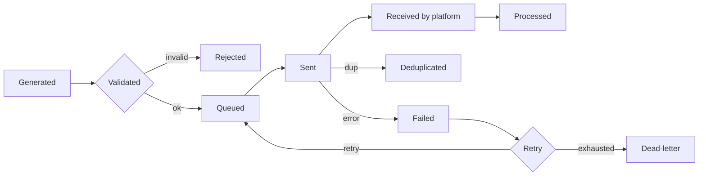

# 04 — Event Health Center specification

> **Status: CONTRACT (Phase 1 — Growth) — 2026-06-28.** Specification for an event monitoring center
> that tracks every event from generation to successful delivery. Built on the tracking spec
> ([arch 16](../architecture/16-tracking-specification.md)), the events catalog
> ([arch 20](../architecture/20-events-catalog.md)), observability
> ([arch 13](../architecture/13-observability.md)), and the Integrations Hub
> ([growth 03](03-INTEGRATIONS_HUB_SPEC.md)). No application code.
>
> **Frozen-UI note:** this is a **net-new monitoring surface and requires approval** before any UI is
> built ([`../ui/`](../ui/README.md)); conceptually it extends the Analytics area. Spec defines
> capability, not UI.

## 1. Cross-cutting compliance baseline

| Concern | Requirement |
|---|---|
| Tracking | Each pipeline stage emits a status record keyed by `event_id`/`dedup_id` ([arch 16](../architecture/16-tracking-specification.md)) |
| Analytics | Health derived in ClickHouse from stage records + `conversion.forwarded` ([arch 20](../architecture/20-events-catalog.md)) |
| Audit logs | Manual redrive/replay actions → `audit.entry.recorded` (WORM) |
| Permissions | View vs. redrive/replay separated ([arch 07](../architecture/07-auth-and-authorization.md)) |
| Feature flags | Per-destination forwarding toggles surfaced here |
| Dark mode / Responsive | Operator surface uses frozen tokens + responsive rules |
| Localization | Labels/diagnostics i18n-keyed; delays/timestamps locale-aware |
| Accessibility | WCAG 2.2 AA |
| Version history | Diagnostics reference the payload/profile version ([growth 05](05-PURCHASE_PAYLOAD_MANAGER_SPEC.md)) |

## 2. Event lifecycle

| State | Meaning |
|---|---|
| Generated | Emitted by browser/server/edge |
| Validated | Passed schema + consent gate ([arch 16 §5/§9](../architecture/16-tracking-specification.md)) |
| Queued | Accepted onto the backbone / forwarder queue |
| Sent | Dispatched to a destination |
| Received | Destination acknowledged receipt |
| Processed | Destination accepted/matched the event |
| Rejected | Failed validation/consent (not sent) |
| Deduplicated | Collapsed by shared `dedup_id` (pixel↔CAPI) — expected, not an error |
| Failed | Delivery error (retryable or terminal) |

## 3. Metrics (per platform × event)

| Metric | Definition |
|---|---|
| Retry count | Attempts beyond the first |
| Success rate | processed / (generated − rejected − deduplicated) over window |
| Average delay | mean(received_at − occurred_at) |
| Last delivery | timestamp of most recent processed event |
| Health score | weighted composite of success rate, delay, retry pressure, and dedup ratio → healthy / degraded / failing |

## 4. Per-platform health view

One health card/row per destination: GA4, Meta, TikTok, Snap, Google Ads, Pinterest, Microsoft
Ads — plus the **internal** sink (ClickHouse ingest). Each shows the §2 state counts, the §3
metrics, and the current Integrations-Hub connection status ([growth 03](03-INTEGRATIONS_HUB_SPEC.md)).

## 5. Filtering

All views filterable by: **Platform, Store, Campaign, UTM, Product, Order, Date, User** (and event
name + state). Filters compose; drill-down from an aggregate count to the individual events behind it.

## 6. Diagnostics and troubleshooting

- **Per-event trace:** the full lifecycle for a single `event_id` across stages and platforms, with the exact payload sent (PII-redacted) and the destination's response.
- **Failure taxonomy → remediation:** auth/expired token → reconnect ([growth 03](03-INTEGRATIONS_HUB_SPEC.md)); schema/validation → fix mapping/profile ([growth 05](05-PURCHASE_PAYLOAD_MANAGER_SPEC.md)); consent-blocked → expected, shown distinctly; rate-limit/quota → backoff status; mapping mismatch → field-level diff.
- **Redrive/replay:** because raw events are retained ([arch 16](../architecture/16-tracking-specification.md)), failed/DLQ events can be replayed after a fix; replays are idempotent (dedup-safe) and audited.

## 7. Data source / instrumentation

Each forwarder/collector stage writes a status record keyed by `event_id`; `conversion.forwarded`
([arch 20](../architecture/20-events-catalog.md)) carries per-platform delivery results. Health is
computed in ClickHouse; alerts integrate with observability ([arch 13](../architecture/13-observability.md))
on failure spikes, success-rate drops, delay growth, or DLQ growth.

## 8. Frozen-UI surface mapping

Net-new surface — **requires approval** ([`../ui/`](../ui/README.md)).

## Requires ADR to change

- The event lifecycle state set, the health-score composition, or the filtering dimensions.
- The instrumentation contract (per-stage status keyed by `event_id`) or the redrive/replay idempotency rule.
- Introducing the admin surface (also requires UI approval).
