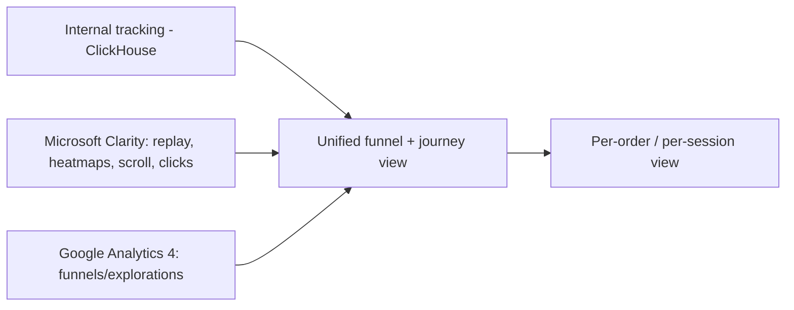

# 09 — Session Replay & Funnel Center specification

> **Status: CONTRACT (Phase 1 — Growth) — 2026-06-28.** Specification for a unified funnel-analysis +
> session-replay module. Built on internal tracking ([arch 16](../architecture/16-tracking-specification.md)),
> analytics ([arch 10](../architecture/10-analytics-and-feed-engine.md)), attribution
> ([arch 17](../architecture/17-attribution-specification.md)), and external connectors via the
> Integrations Hub ([growth 03](03-INTEGRATIONS_HUB_SPEC.md)). No application code.
>
> **Frozen-UI note:** the frozen admin has a **Funnels** screen — funnel analysis extends that
> screen's functionality (no redesign). The **per-order session-replay viewer** is a **net-new
> surface and requires approval** (the frozen Orders screen has no detail drawer per [`../ui/`](../ui/README.md)).

## 1. Cross-cutting compliance baseline

| Concern | Requirement |
|---|---|
| Tracking | Funnels are built on first-party events ([arch 16](../architecture/16-tracking-specification.md)); the internal pipeline is the authoritative funnel source |
| Analytics | Funnel/drop-off computed in ClickHouse ([arch 10](../architecture/10-analytics-and-feed-engine.md)) |
| Audit logs | Viewing a replay / exporting → `audit.entry.recorded` (WORM) — replays contain behavior data |
| Permissions | Replay/PII view is a restricted permission ([arch 07](../architecture/07-auth-and-authorization.md)); step-up to view |
| Feature flags | Replay capture + per-source integration toggles |
| Dark mode / Responsive | Operator surface uses frozen tokens + responsive rules |
| Localization | Labels i18n-keyed; timestamps locale/timezone-aware |
| Accessibility | WCAG 2.2 AA |
| Version history | Funnel definitions versioned |

## 2. Data sources

| Source | Role | Connector |
|---|---|---|
| Internal tracking | Authoritative funnels, journeys, drop-off (first-party) | native ([arch 16](../architecture/16-tracking-specification.md)) |
| Microsoft Clarity | Session replay, heatmaps, scroll depth, click maps | Clarity API/MCP ([growth 03](03-INTEGRATIONS_HUB_SPEC.md)) |
| Google Analytics 4 | Cross-check funnels/explorations | GA4 connector ([growth 03](03-INTEGRATIONS_HUB_SPEC.md)) |

Internal tracking is the source of truth; Clarity and GA4 enrich/corroborate. Stitching key:
shared `visitor_id`/`session_id`/`journey_id` ([arch 17](../architecture/17-attribution-specification.md)).

## 3. Unified funnel analysis

- Funnels defined over internal events (any step sequence), with conversion + drop-off per step, segmentable by the §5 dimensions.
- Drop-off points link to representative Clarity recordings + heatmaps for the abandoning step.
- GA4 figures shown alongside for reconciliation.

## 4. Per-order / per-session view

For a given order or session, surface (read-only): **session replay** (Clarity), **journey timeline**
(touchpoints, [arch 17](../architecture/17-attribution-specification.md)), **UTMs**, **events**
([arch 16](../architecture/16-tracking-specification.md)), **funnel position**, **drop-off points**,
**heatmaps**, **scroll depth**, **clicks**, **device**, **browser**, **country**, **campaign**,
**landing page**.

## 5. Filtering / dimensions

Platform/source, store, campaign, UTM, product, order, date, user, device, browser, country,
landing page, new vs. returning, segment.

## 6. Privacy and consent (mandatory)

- Replay **masks all PII and input fields by default**; payment fields are always masked; recordings are consent-gated.
- **No child-linked session is ever recorded or replayed**; no minor behavioral data ([arch 14](../architecture/14-security.md)).
- Replay access is a restricted, audited, step-up-gated permission; retention is capped and erasure-honoring.

## 7. Frozen-UI surface mapping

Funnel analysis extends the frozen **Funnels** screen (functionality only). The per-order replay
viewer is a net-new surface — **requires approval** ([`../ui/`](../ui/README.md)).

## Requires ADR to change

- Internal tracking as the authoritative funnel source, or the source-stitching key.
- The privacy model (default masking, no minor recording, restricted/audited access).
- Introducing the per-order replay surface (also requires UI approval).
