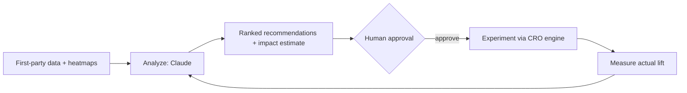

# 10 — AI CRO Assistant specification

> **Status: CONTRACT (Phase 1 — Growth) — 2026-06-28.** Specification for an AI-powered optimization
> assistant. Reasons over the first-party data plane ([arch 10](../architecture/10-analytics-and-feed-engine.md),
> [growth — Analytics Hub](../analytics/01-ANALYTICS_HUB_SPEC.md)), session insights
> ([growth 09](09-SESSION_REPLAY_AND_FUNNEL_SPEC.md)), and tracking
> ([arch 16](../architecture/16-tracking-specification.md)); proposes experiments through the CRO
> engine ([growth 01](01-CRO_ENGINE_SPEC.md) / [arch 21](../architecture/21-experimentation-and-cro.md)).
> No application code.
>
> **Frozen-UI note:** **net-new surface, requires approval** ([`../ui/`](../ui/README.md)); could
> surface in the Dashboard. Critically, the assistant **proposes only — it never auto-applies UI or
> theme changes**; any UI-affecting recommendation goes through the frozen-UI approval process.

## 1. Cross-cutting compliance baseline

| Concern | Requirement |
|---|---|
| Tracking | Recommendations + outcomes are tracked; accepted ideas become experiments ([arch 16](../architecture/16-tracking-specification.md)) |
| Analytics | Reasons over ClickHouse; impact validated by experiments ([arch 10](../architecture/10-analytics-and-feed-engine.md)) |
| Audit logs | Every recommendation, acceptance, dismissal → `audit.entry.recorded` (WORM) |
| Permissions | Suggestions visible per role; acting on one requires that capability's permission ([arch 07](../architecture/07-auth-and-authorization.md)) |
| Feature flags | Assistant + each analysis type behind flags; kill switch |
| Dark mode / Responsive | Operator surface uses frozen tokens + responsive rules |
| Localization | Output localized |
| Accessibility | WCAG 2.2 AA |
| Version history | Recommendation runs are versioned/snapshotted with their evidence |

## 2. Model strategy

Uses Claude (latest models, per platform standard). Tiered for cost/latency:

| Tier | Model | Use |
|---|---|---|
| Deep analysis + synthesis | Claude Opus 4.8 (`claude-opus-4-8`) | Multi-signal diagnosis, recommendation synthesis, impact reasoning |
| Routine / scheduled | Claude Sonnet 4.6 (`claude-sonnet-4-6`) | Recurring scans, summaries |
| Triage / classification | Claude Haiku 4.5 (`claude-haiku-4-5-20251001`) | Anomaly tagging, routing, cheap pre-filters |

Constraints: reasons over **our** first-party data only; customer data is **not** used to train models; **no child data** is ever an input; outputs are grounded (every recommendation cites the data behind it). The assistant is **read-only** over data and **never** mutates UI/theme/config autonomously.

## 3. Inputs analyzed

Conversion rate, bounce rate, revenue, funnels + drop-off ([growth 09](09-SESSION_REPLAY_AND_FUNNEL_SPEC.md)),
product performance, campaign performance ([arch 17](../architecture/17-attribution-specification.md)),
heatmaps + session-recording summaries (Clarity, [growth 09](09-SESSION_REPLAY_AND_FUNNEL_SPEC.md)),
inventory, and checkout analytics — all sourced from existing first-party stores; PII/child data excluded.

## 4. Recommendation catalog

Each recommendation carries: rationale, evidence (the cited metrics/segments), estimated revenue
impact (range + confidence), effort estimate, and an implementation path.

| Recommendation | Typical trigger | Implementation path |
|---|---|---|
| Move CTA | low CTA visibility / heatmap | layout-builder change → experiment ([growth 02](02-PRODUCT_LAYOUT_BUILDER_SPEC.md)) |
| Improve hero section | high bounce on landing | layout/content variant → experiment |
| Replace images | low engagement on gallery | media swap → experiment |
| Improve product description | low PDP conversion | content edit → experiment |
| Increase trust signals | checkout anxiety / drop-off | trust-badge module ([growth 01](01-CRO_ENGINE_SPEC.md)) → experiment |
| Optimize checkout | checkout funnel drop-off | flow/field change → experiment |
| Suggest upsells | low AOV | CRO upsell module config |
| Suggest cross-sells | low attach rate | CRO cross-sell module config |
| Suggest experiments | uncertain hypothesis | scoped A/B/MVT via CRO engine |
| Estimate revenue impact | any of the above | funnel-delta + benchmark + historical-lift model |

## 5. Implementation priority

Priority score = (estimated revenue impact × confidence) ÷ effort → an ordered, de-duplicated
backlog. Each item can be launched as an experiment in one approval step (config, not deploy).

## 6. Revenue-impact estimation and the loop

Estimates are ranges with confidence; the **only** source of truth for realized impact is the
experiment that follows ([arch 21](../architecture/21-experimentation-and-cro.md)) — the loop
calibrates future estimates.

## 7. Human-in-the-loop guardrails

- The assistant **recommends**; humans decide. No autonomous changes to UI, theme, pricing, or config.
- UI-affecting recommendations require frozen-UI approval ([`../ui/`](../ui/README.md)); experiment launches require the experiment permission; all actions are audited.

## 8. Frozen-UI surface mapping

Net-new surface — **requires approval**. Recommendations may surface read-only in the Dashboard once approved.

## Requires ADR to change

- The "proposes only / never auto-applies" guardrail, the read-only-over-data + no-child-data + no-training rules.
- The model tiering (Claude), the priority-score formula, or the experiment-validates-impact loop.
- Introducing the admin surface (also requires UI approval).
