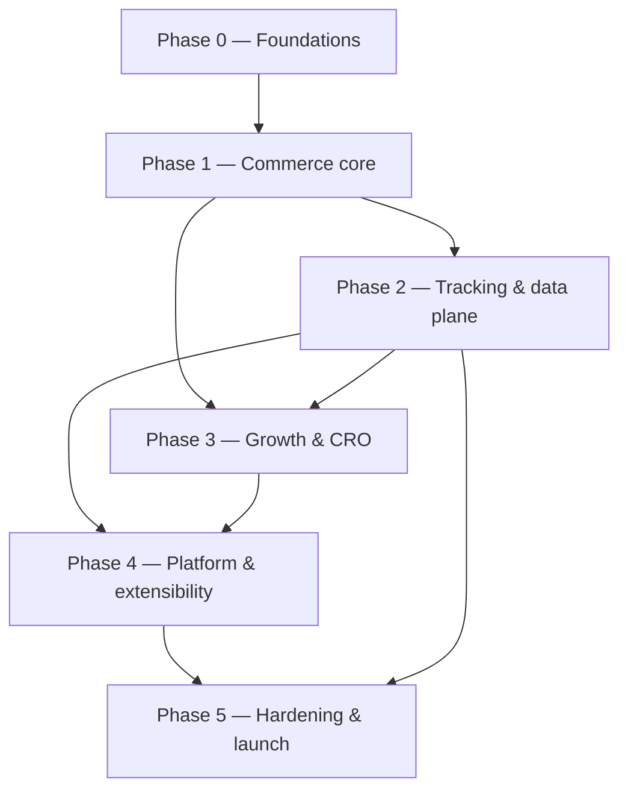

# Implementation Roadmap

> **Status: PLAN — 2026-06-28.** The bridge from Phase 1 (architecture & documentation) to build.
> This roadmap sequences the implementation of the **already-approved contract** — it adds no new
> requirements. The contract is authoritative:
> [`../architecture/`](../architecture/README.md) (system architecture, 01–21 + ADRs),
> [`../ui/`](../ui/README.md) (**frozen** UI), [`../growth/`](../growth/) (01–10),
> [`../analytics/01`](../analytics/01-ANALYTICS_HUB_SPEC.md), [`../admin/01`](../admin/01-ADMIN_DASHBOARD_SPEC.md),
> and [`../platform/`](../platform/) (01–05).
>
> **Entering implementation is ADR-gated.** Record the go-decision as an ADR
> ([`../architecture/adr/`](../architecture/adr/)) before Phase 0 work begins; this document does not
> itself authorize building.

## 1. Implementation principles

1. **Build to the contract, not beyond it.** Every PR traces to a spec section. Anything not covered ⇒ ADR first; no improvisation.
2. **UI is frozen.** Implement the admin 1:1 against [`../ui/`](../ui/README.md); wire functionality behind existing controls per [`../admin/01`](../admin/01-ADMIN_DASHBOARD_SPEC.md). Any net-new surface (workflow builder, integrations hub, Customer 360 view, etc.) requires UI approval before its slice starts.
3. **Modular monolith first** ([ADR-0001](../architecture/adr/0001-modular-monolith-with-strangler-extraction.md)); the data-plane/high-throughput services run separately from day one; extract others only on measured need.
4. **Thin vertical slices (walking skeleton).** Ship an end-to-end path early, then deepen — never a horizontal layer in isolation.
5. **Everything behind a flag** ([`../growth/06`](../growth/06-FEATURE_MANAGEMENT_SPEC.md)); deploy ≠ release; instant kill switch.
6. **Quality + observability from line one** — tests, contracts, telemetry, audit are part of "done", not a later phase.
7. **No spec drift.** Contract changes go through ADRs; UI changes through the frozen-UI approval.

## 2. Phase map and dependencies

Phases 2 and 3 overlap once the core is stable; Phase 4 depends on both the data plane (P2) and growth primitives (P3).

## 3. Phases

### Phase 0 — Foundations *(platform plumbing; indicative L)*
- **Goal:** a deployable, observable, secure empty skeleton with all shared plumbing.
- **Scope / specs:** monorepo + packages + boundaries ([arch 02](../architecture/02-monorepo-packages-and-feature-first.md)); CI/CD + GitOps + IaC ([arch 15](../architecture/15-scalability-and-deployment.md)); observability baseline ([arch 13](../architecture/13-observability.md)); event backbone + outbox/CDC + schema registry ([arch 05](../architecture/05-events-queues-workers-and-jobs.md)); per-context Postgres + read-store wiring ([arch 03](../architecture/03-domain-and-database-boundaries.md)); config + secrets ([arch 12](../architecture/12-feature-flags-and-configuration.md), [arch 14](../architecture/14-security.md)); auth foundation (Ory, [arch 07](../architecture/07-auth-and-authorization.md)); feature-flag SDK ([arch 12](../architecture/12-feature-flags-and-configuration.md)).
- **Exit criteria:** a "hello-domain" service deploys via GitOps through dev→staging; emits an event through the outbox→Redpanda→consumer; traces/logs/metrics visible; dependency-cruiser fitness functions enforced in CI; secrets from Vault; one flag evaluated end-to-end.

### Phase 1 — Commerce core *(transactional MVP; indicative L)*
- **Goal:** the end-to-end purchase path works.
- **Scope / contexts:** catalog, media, pricing, inventory, cart, checkout, orders, payments, identity/customers ([arch 03](../architecture/03-domain-and-database-boundaries.md)); checkout/fulfillment sagas in Temporal ([arch 05](../architecture/05-events-queues-workers-and-jobs.md)); storefront browse→PDP→cart→checkout→order; admin functionality behind the frozen **Products, Inventory, Orders, Customers, Discounts, Coupons** screens ([admin/01](../admin/01-ADMIN_DASHBOARD_SPEC.md)).
- **Exit criteria:** a real order can be placed and paid (test PSP), inventory reserved/decremented atomically, order events immutable, refunds work; admin screens render 1:1 with the frozen UI and operate on real data; contract tests green.

### Phase 2 — Tracking & data plane *(indicative L)*
- **Goal:** own the data; measure everything.
- **Scope / specs:** tracking SDK + edge beacon + collector ([arch 16](../architecture/16-tracking-specification.md)); ClickHouse pipeline + materialized views ([arch 10](../architecture/10-analytics-and-feed-engine.md)); attribution + identity stitching ([arch 17](../architecture/17-attribution-specification.md)); server-side tracking/CAPI ([arch 09](../architecture/09-tracking-and-server-side-tracking.md)); purchase payload manager ([growth 05](../growth/05-PURCHASE_PAYLOAD_MANAGER_SPEC.md)); event health center ([growth 04](../growth/04-EVENT_HEALTH_CENTER_SPEC.md)); integrations hub ([growth 03](../growth/03-INTEGRATIONS_HUB_SPEC.md)); analytics hub ([analytics/01](../analytics/01-ANALYTICS_HUB_SPEC.md)). Wire frozen **Analytics, Funnels, UTM reports**.
- **Exit criteria:** events flow first-party → ClickHouse with schema-registry validation; a purchase de-duplicates across pixel + CAPI; funnels/attribution queryable; consent gating + child-data exclusion verified.

### Phase 3 — Growth & CRO *(indicative L; overlaps P2)*
- **Goal:** flexible merchandising, experimentation, and lifecycle marketing.
- **Scope / specs:** experimentation + feature management ([arch 21](../architecture/21-experimentation-and-cro.md), [growth 06](../growth/06-FEATURE_MANAGEMENT_SPEC.md)); CRO engine + conversion modules ([growth 01](../growth/01-CRO_ENGINE_SPEC.md)); product layout builder + CMS/landing ([growth 02](../growth/02-PRODUCT_LAYOUT_BUILDER_SPEC.md)); marketing core + email/WhatsApp/automations ([arch 08](../architecture/08-marketing-core.md), [growth 07](../growth/07-COMMERCE_MODULES_SPEC.md)); feed engine ([arch 18](../architecture/18-product-feed-specification.md)). Wire frozen **A/B testing, Feature flags, Upsells, Cross-sells, Marketing, Email, WhatsApp, Automations, Landing pages, Page builder, Reviews**.
- **Exit criteria:** an A/B test assigns deterministically (no flash), logs exposure, and reports significance; a CRO module ships behind a flag with a kill switch; a feed syncs to one channel; a lifecycle automation fires from an event.

### Phase 4 — Platform & extensibility *(indicative XL)*
- **Goal:** the differentiating platform capabilities.
- **Scope / specs:** workflow automation engine ([platform 01](../platform/01-WORKFLOW_AUTOMATION_ENGINE_SPEC.md)); rule engine ([platform 02](../platform/02-RULE_ENGINE_SPEC.md)); Customer 360 ([platform 03](../platform/03-CUSTOMER_360_SPEC.md)); search & recommendation engine ([platform 04](../platform/04-SEARCH_AND_RECOMMENDATION_ENGINE_SPEC.md)); plugin SDK ([platform 05](../platform/05-PLUGIN_SDK_SPEC.md)); AI CRO assistant ([growth 10](../growth/10-AI_CRO_ASSISTANT_SPEC.md)); session replay & funnel ([growth 09](../growth/09-SESSION_REPLAY_AND_FUNNEL_SPEC.md)); remaining commerce modules — loyalty, gift cards, subscriptions, referrals, affiliate, store credit ([growth 07](../growth/07-COMMERCE_MODULES_SPEC.md)); theme developer ([growth 08](../growth/08-THEME_DEVELOPER_SPEC.md)).
- **Exit criteria:** a workflow runs durably end-to-end; a rule set simulates → approves → publishes; Customer 360 assembles a privacy-safe profile; hybrid search + one recommendation surface live and experimentable; one signed sandboxed plugin installs and runs isolated.

### Phase 5 — Hardening & launch *(indicative M)*
- **Goal:** prove the non-functionals and go live.
- **Scope / specs:** load tests to peak +30% and performance budgets ([arch 15](../architecture/15-scalability-and-deployment.md)); security review + pentest + supply-chain ([arch 14](../architecture/14-security.md)); COPPA/GDPR-K compliance sign-off; DR/restore drills; multi-region reads; accessibility + localization audit of storefront.
- **Exit criteria:** SLOs met under load; pentest findings remediated; RPO/RTO drills pass; compliance signed off; launch ADR recorded.

## 4. Cross-cutting workstreams (run in every phase)

| Workstream | Standard |
|---|---|
| Testing/QA | Unit + integration (testcontainers) + contract (Pact) + e2e; **≥80% coverage** |
| Observability | OpenTelemetry traces/logs/metrics + Sentry from first commit ([arch 13](../architecture/13-observability.md)) |
| Security/privacy | No hardcoded secrets; input validation at boundaries; consent + child-data rules ([arch 14](../architecture/14-security.md)) |
| Architecture fitness | dependency-cruiser boundary rules + no-cross-context-FK enforced in CI ([arch 02](../architecture/02-monorepo-packages-and-feature-first.md)/[03](../architecture/03-domain-and-database-boundaries.md)) |
| Docs/ADRs | Specs updated only via ADR; runbooks per service |
| Accessibility/localization | Storefront WCAG 2.2 AA + i18n (admin already meets the frozen baseline) |

## 5. Definition of done (every vertical slice)

Conforms to its spec · admin renders 1:1 with the frozen UI (if it has a surface) · tests pass at ≥80% coverage · contract tests green · fitness functions pass · instrumented (traces/metrics/logs) · emits the specified events + audit records · behind a feature flag with a kill switch · errors handled explicitly (no silent catch) · no hardcoded secrets · accessible + localized where user-facing · spec/runbook updated.

## 6. Governance and gates

- **Phase entry/exit** is sign-off-gated; the go-live for each phase is recorded as an ADR.
- **Spec drift** is prohibited — discovered gaps become ADRs that update the contract before code.
- **Frozen UI** — implementation matches [`../ui/`](../ui/README.md); any deviation or new surface is blocked until approved.

## 7. Sequencing rationale & risk

| Decision | Rationale |
|---|---|
| Foundations before features | Boundaries, events, observability, and flags are cheap early and ruinous to retrofit |
| Core before data plane | You can't measure conversions you can't yet transact |
| Data plane before/with growth | CRO + attribution + feeds depend on first-party tracking being trustworthy |
| Platform last | Workflow/rules/360/search/plugins compose the lower layers; building them first would couple to unstable contracts |

| Risk | Mitigation |
|---|---|
| Boundary erosion under deadline pressure | CI fitness functions fail the build, not a code review opinion |
| UI drift from the frozen contract | Visual diff against the frozen prototype; approval gate on any change |
| Data-plane scope creep | First-party ownership + consent are exit criteria, not nice-to-haves |
| Big-bang platform phase | Plugin SDK + workflow + rules ship as thin slices behind flags, not all at once |

## 8. Indicative milestones

M0 Foundations → M1 Commerce core (purchasable) → M2 Tracking/data plane (measurable) → M3 Growth/CRO (optimizable) → M4 Platform/extensibility (composable) → M5 Hardening (launch-ready). Durations depend on team capacity and are set per-phase at entry sign-off; this document fixes **order and exit criteria**, not calendar dates.

## Requires ADR to change

- The phase order, the per-phase exit criteria, or the definition of done.
- The "build to contract / no spec drift / UI frozen" governance, or the foundations-first sequencing.
