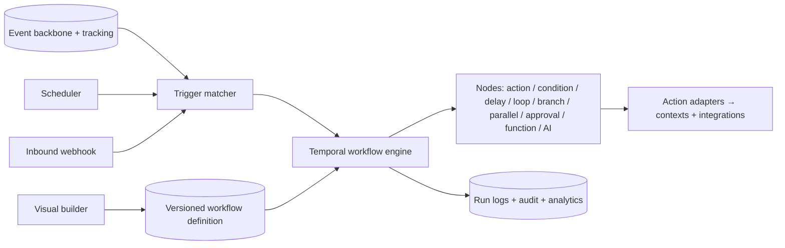

# 01 — Workflow Automation Engine specification

> **Status: CONTRACT (Phase 1 — Platform) — 2026-06-28.** A visual, integrated workflow automation
> platform (n8n / Shopify Flow / Zapier / Make class). No application code. The UI is frozen
> ([`../ui/`](../ui/README.md)); the visual builder is a **net-new surface and requires approval**
> (the frozen **Automations** screen is the entry point but does not contain a full node editor).

## 1. Business goals

Let operators automate lifecycle, ops, and growth logic without engineering — turning the platform's
events into actions, safely, observably, and reversibly. Replace per-feature bespoke automation with
one durable engine.

## 2. Architecture

Built on **Temporal** (durable execution, [arch 05](../architecture/05-events-queues-workers-and-jobs.md))
and the event backbone ([arch 20](../architecture/20-events-catalog.md)). The visual builder compiles
to a **versioned workflow definition (declarative DSL/config, not code)** executed by Temporal workers.

Node types: **trigger, action, condition (IF/ELSE), delay, loop, branch, parallel, manual approval
(human task), sub-workflow, function (sandboxed expression), webhook/HTTP, AI action**. Variables flow
through a typed run context; functions are sandboxed pure expressions (no arbitrary I/O).

### 2.1 Triggers (event-sourced)
Subscriptions over tracking ([arch 16](../architecture/16-tracking-specification.md)) + domain events ([arch 20](../architecture/20-events-catalog.md)) + schedule + webhook.

| Trigger | Source event |
|---|---|
| Customer Registered / Login | `identity.customer.registered` / `identity.session.started` |
| Product Viewed / Add to Cart / Remove from Cart | `product_viewed` / `cart.item_added` / `cart.item_removed` |
| Begin Checkout / Add Shipping / Add Payment | `checkout_started` / `checkout_shipping_added` / `checkout_payment_added` |
| Purchase / Refund | `orders.order.paid` / `payments.refund.issued` |
| Order Created / Paid / Cancelled / Delivered | `orders.order.placed` / `.paid` / `.cancelled` / `orders.shipment.delivered` |
| Low Inventory / Out of Stock | `inventory.stock.low` / `inventory.stock.depleted` |
| Product Updated / Price Changed | `catalog.product.published` / `pricing.*.changed` |
| Review Submitted / Wishlist Updated | review submit / `wishlist.item_added` |
| Loyalty Updated / Referral Completed / Subscription Renewed | loyalty / referral / subscription events ([growth 07](../growth/07-COMMERCE_MODULES_SPEC.md)) |
| UTM Matched / Audience Entered | touchpoint rule ([arch 17](../architecture/17-attribution-specification.md)) / `marketing.segment` |
| Feature Flag Changed / Experiment Started / Finished | `flag.changed` / `experiment.launched` / `experiment.concluded` |

### 2.2 Actions (adapters to contexts + integrations)
| Group | Actions |
|---|---|
| Messaging | Send Email / WhatsApp / SMS / Push (Notifications, Marketing) |
| Audience / data systems | Create Audience, Update CRM, Update ERP ([growth 03](../growth/03-INTEGRATIONS_HUB_SPEC.md)) |
| Commerce | Create Coupon, Grant Loyalty Points, Generate Gift Card, Update Product, Update Inventory |
| Ad platforms | Meta CAPI, Google Ads, TikTok Events, Snap Events ([arch 09](../architecture/09-tracking-and-server-side-tracking.md), [growth 05](../growth/05-PURCHASE_PAYLOAD_MANAGER_SPEC.md)) |
| Tasks / notify | Create Task, Notify Slack, Notify Discord, Human Task (approval) |
| Generic | Webhook, HTTP Request (egress-allowlisted) |
| AI | Execute AI Assistant ([growth 10](../growth/10-AI_CRO_ASSISTANT_SPEC.md)) |
| Data | Read-model update, Search index update ([04](04-SEARCH_AND_RECOMMENDATION_ENGINE_SPEC.md)), Feed regeneration ([arch 18](../architecture/18-product-feed-specification.md)) |

Capabilities: conditions, delays, loops, variables, functions, error handling, retry logic, branching,
parallel execution, manual approval, scheduling, webhooks, API calls, AI actions, human tasks.

## 3. Domain boundaries

A dedicated **Workflow/Automation** context (extends [arch 08](../architecture/08-marketing-core.md)'s
automation). It orchestrates other contexts only via their public APIs/events — never their data
directly; no cross-context FK ([arch 03](../architecture/03-domain-and-database-boundaries.md)).

## 4. Database ownership

Owns: workflow definitions, versions, run instances, run-steps, approvals, variables. Execution state
is owned by Temporal; run history is mirrored to ClickHouse for analytics. References to other
contexts are by id.

## 5. Tracking
Trigger matches, node executions, and outcomes emit operational events ([arch 16](../architecture/16-tracking-specification.md)); action side-effects emit their own domain events.

## 6. Analytics
Run volume, success/failure rate, step latency, conversion impact of automations — in ClickHouse ([../analytics/01](../analytics/01-ANALYTICS_HUB_SPEC.md)).

## 7. Permissions
Author / publish / approve separated ([arch 07](../architecture/07-auth-and-authorization.md)); each action node requires the underlying capability's permission; destructive actions need step-up.

## 8. Audit logs
Every definition change, publish, run-start, approval decision, and manual override → `audit.entry.recorded` (WORM, [arch 14](../architecture/14-security.md)).

## 9. Feature flags
The engine, each trigger type, and each action type are independently flaggable with a kill switch ([growth 06](../growth/06-FEATURE_MANAGEMENT_SPEC.md)).

## 10. Observability
OpenTelemetry traces span trigger → engine → node → action; structured run logs with debug mode (per-node input/output, PII-redacted) ([arch 13](../architecture/13-observability.md)).

## 11. Performance
Triggers evaluated off the event stream (no hot-path coupling); node fan-out is async; target trigger-to-first-action p95 < 2s for real-time triggers.

## 12. Security
Sandboxed functions (no arbitrary I/O), egress-allowlisted HTTP, secrets from Vault, scoped action permissions; no workflow can exceed the author's own permissions.

## 13. Privacy
Consent-gated messaging/forwarding actions; no child-data-driven automations ([arch 14](../architecture/14-security.md)).

## 14. Scalability
Stateless Temporal workers scaled by task-queue depth (KEDA); per-tenant concurrency limits; parallel branches bounded.

## 15. Failure recovery
Durable Temporal state survives crashes; per-node retry with backoff + DLQ; compensation for partially-completed flows; runs resumable/replayable.

## 16. Monitoring
Dashboards + alerts on failure spikes, stuck approvals, queue lag, and DLQ growth ([arch 13](../architecture/13-observability.md)).

## 17. Version history
Definitions are immutable versions; draft → publish; rollback to any prior version; in-flight runs pinned to their definition version.

## 18. Extension points
Custom trigger sources, custom action nodes, and AI nodes are added via the Plugin SDK ([05](05-PLUGIN_SDK_SPEC.md)).

## 19. Dependencies
Temporal, event backbone, Notifications, Integrations Hub, Rule Engine ([02](02-RULE_ENGINE_SPEC.md)) for conditions, AI Assistant.

## 20. Cross references
[arch 05](../architecture/05-events-queues-workers-and-jobs.md), [arch 08](../architecture/08-marketing-core.md), [arch 20](../architecture/20-events-catalog.md), [growth 03](../growth/03-INTEGRATIONS_HUB_SPEC.md), [growth 06](../growth/06-FEATURE_MANAGEMENT_SPEC.md), [growth 10](../growth/10-AI_CRO_ASSISTANT_SPEC.md), [02](02-RULE_ENGINE_SPEC.md).

## 21. Risk analysis
| Risk | Mitigation |
|---|---|
| Runaway loops / fan-out | Loop bounds, concurrency caps, budget guards |
| Infinite trigger cycles (action re-triggers workflow) | Cycle detection + per-entity dedup/cooldown |
| Operator builds a destructive flow | Permission ceiling, approval steps, dry-run/simulate |
| Action provider outage | Retry + DLQ + circuit breaker, no run loss |

## 22. Future roadmap
Marketplace workflow templates, multi-step A/B of workflows, NL-to-workflow authoring via the AI assistant, cross-tenant template sharing.

## Requires ADR to change

- The Temporal + event-sourced-trigger architecture, the declarative versioned-definition model, or the permission-ceiling rule.
- The trigger/action catalogs, or introducing the visual builder admin surface (also requires UI approval per [`../ui/`](../ui/README.md)).
