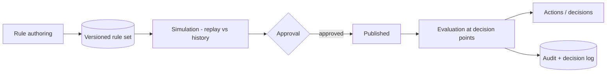

# 02 — Rule Engine specification

> **Status: CONTRACT (Phase 1 — Platform) — 2026-06-28.** A centralized, declarative business rule
> engine used across the platform. No application code. UI frozen ([`../ui/`](../ui/README.md)); a
> rule authoring/simulation surface is **net-new and requires approval**.

## 1. Business goals

One deterministic, auditable, reversible way to express business logic (pricing, shipping, fraud,
personalization, ranking, …) as **config, not code** — authored, simulated, approved, and versioned
by business users without deploys.

## 2. Architecture

A declarative condition/action engine: rules compile to a typed boolean AST
(`IF/ELSE/AND/OR/NOT`, nesting) evaluated deterministically at each domain's **decision points**.
Reusable rule sets, priority-ordered, with explicit conflict resolution. The engine is the shared
primitive already behind discount rules ([arch pricing](../architecture/03-domain-and-database-boundaries.md))
and flag rules ([arch 12](../architecture/12-feature-flags-and-configuration.md)).

- **Operators:** IF, ELSE, AND, OR, NOT, nested rules.
- **Reusable rule sets** + rule groups + rule categories.
- **Priority + conflict resolution:** ordered by priority then specificity; mode is per-domain — `first-match` (e.g. shipping), `accumulate` (e.g. stacking discounts, subject to exclusivity), or `explicit-override`.
- **Scheduling:** active windows (timezone-aware). **Simulation:** dry-run against historical events/orders before publish. **Approval workflow:** draft → review → approve → publish.

## 3. Rule domains
Pricing, Shipping, Coupons, Discounts, Inventory, Marketing, Checkout, Payments, Fraud Detection,
Loyalty, Recommendations, Feature Flags, Personalization, Experiments, Search Ranking, Feeds,
Automation, Tracking, Analytics. Each domain registers its evaluation context (available inputs) and
allowed actions; the engine guarantees only declared inputs/actions are usable.

## 4. Rule definition (every rule)
Conditions, Actions, Priority, Owner, Created date, Approval status, Version, Dependencies, Rollback,
Audit log — all mandatory fields on every rule.

## 5. Domain boundaries
The engine is a shared platform capability (library + optional service). **Rule sets are owned by the
consuming context** (Pricing owns pricing rules) but authored/evaluated through the common engine; no
cross-context FK ([arch 03](../architecture/03-domain-and-database-boundaries.md)).

## 6. Database ownership
Rule definitions/versions live in the owning context's store; the engine library lives in `packages`;
a registry indexes rule sets by domain. Evaluation is stateless; decisions are logged.

## 7. Tracking
Rule evaluations and matches emit decision events for analytics + audit ([arch 16](../architecture/16-tracking-specification.md)).

## 8. Analytics
Rule hit rates, conflict frequency, and decision-outcome impact in ClickHouse ([../analytics/01](../analytics/01-ANALYTICS_HUB_SPEC.md)).

## 9. Permissions
Author / approve / publish separated per domain ([arch 07](../architecture/07-auth-and-authorization.md)); fraud + payment rules require elevated roles + step-up.

## 10. Audit logs
Every create/edit/approve/publish/rollback and every fraud/payment decision → `audit.entry.recorded` (WORM, with policy version, [arch 14](../architecture/14-security.md)).

## 11. Feature flags
Rule sets are flaggable; new rule sets can roll out gradually + kill-switch ([growth 06](../growth/06-FEATURE_MANAGEMENT_SPEC.md)).

## 12. Observability
Each evaluation is traceable (which rules fired, in what order, why) with a decision explanation ([arch 13](../architecture/13-observability.md)).

## 13. Performance
Compiled ASTs, cached rule sets (L1), short-circuit evaluation; target p99 < 10ms for hot decision points (pricing/search ranking).

## 14. Security
Conditions are sandboxed expressions over declared inputs only — no arbitrary code/I/O; actions limited to the domain's allowlist.

## 15. Privacy
No child data as a rule input; consent respected for marketing/personalization rules ([arch 14](../architecture/14-security.md)).

## 16. Scalability
Stateless evaluation scales horizontally; rule sets are small + cacheable; simulation runs as batch jobs.

## 17. Failure recovery
Engine failure fails safe to the domain's documented default (e.g. no discount, standard shipping); evaluation errors are logged, never silently applied.

## 18. Monitoring
Alerts on conflict spikes, fraud-rule false-positive rate, and evaluation latency regressions.

## 19. Version history
Immutable rule versions; rollback to any prior version; in-flight decisions reference the version that produced them.

## 20. Extension points
Custom condition operators and domain actions via the Plugin SDK ([05](05-PLUGIN_SDK_SPEC.md)).

## 21. Dependencies
Owning contexts (pricing, shipping, fraud, search, …), Feature flags, Workflow engine ([01](01-WORKFLOW_AUTOMATION_ENGINE_SPEC.md)) which uses rules for conditions.

## 22. Cross references
[arch 03](../architecture/03-domain-and-database-boundaries.md), [arch 12](../architecture/12-feature-flags-and-configuration.md), [arch 21](../architecture/21-experimentation-and-cro.md), [01](01-WORKFLOW_AUTOMATION_ENGINE_SPEC.md), [04](04-SEARCH_AND_RECOMMENDATION_ENGINE_SPEC.md).

## 23. Risk analysis & future roadmap
| Risk | Mitigation |
|---|---|
| Conflicting rules cause wrong prices | Conflict resolution + simulation + approval before publish |
| Fraud rule over-blocks | Shadow mode + false-positive monitoring + fast rollback |
| Rule sprawl | Categories, ownership, expiry/review, dependency graph |

**Roadmap:** NL-to-rule authoring (AI), automatic conflict detection, what-if optimization against historical outcomes.

## Requires ADR to change

- The declarative AST model, the per-domain conflict-resolution modes, or the fail-safe-defaults rule.
- The mandatory rule fields, the simulate-then-approve-then-publish flow, or introducing the authoring surface (also requires UI approval per [`../ui/`](../ui/README.md)).
