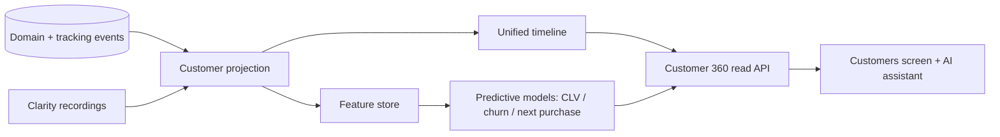

# 03 — Customer 360 specification

> **Status: CONTRACT (Phase 1 — Platform) — 2026-06-28.** A unified customer intelligence profile. No
> application code. UI frozen ([`../ui/`](../ui/README.md)); the frozen **Customers** screen is the
> entry point, but the full 360 timeline detail view is a **net-new surface and requires approval**.

## 1. Business goals

Give operators (and the AI assistant) one trustworthy, privacy-safe, unified view of each
customer/household — every interaction, value, and prediction — to power service, segmentation, and
personalization.

## 2. Architecture

An event-sourced **read model**: it consumes domain + tracking events into a unified per-customer /
per-household timeline + feature store; ML models compute predictive scores; served read-only to the
Customers screen and APIs. It **owns no source data** — each context remains the owner (CQRS).

### 2.1 Unified timeline (all sources)
Identity, sessions, devices, browsers, UTMs, campaigns, journey timeline ([arch 17](../architecture/17-attribution-specification.md)),
orders, purchases, refunds, returns, wishlist, reviews, loyalty, gift cards, affiliate activity,
referrals, subscriptions, email/WhatsApp/SMS history, support tickets, Clarity recordings
([growth 09](../growth/09-SESSION_REPLAY_AND_FUNNEL_SPEC.md)), funnels, experiments, feature flags,
recommendations.

### 2.2 Intelligence
CLV, predicted LTV, churn risk, predicted next purchase, RFM score, customer health score, segments
([arch 19](../architecture/19-marketing-data-model.md)), AI insights ([growth 10](../growth/10-AI_CRO_ASSISTANT_SPEC.md)).
Plus: export, privacy controls, consent history, audit history.

## 3. Domain boundaries
A read-only intelligence context; assembles a projection from other contexts via events; writes back
only through their public APIs; no cross-context FK ([arch 03](../architecture/03-domain-and-database-boundaries.md)).

## 4. Database ownership
Owns the customer profile/timeline store (ClickHouse for the event timeline + a serving store for the
assembled profile) and the ML feature store. References source records by id. **Child data is
excluded/isolated** ([arch 14](../architecture/14-security.md)).

## 5. Tracking
Profile views/exports emit audited access events ([arch 16](../architecture/16-tracking-specification.md)).

## 6. Analytics
Powers segmentation + the analytics hub ([../analytics/01](../analytics/01-ANALYTICS_HUB_SPEC.md)); scores feed CRO + marketing.

## 7. Permissions
Field-level scoping ([arch 07](../architecture/07-auth-and-authorization.md)): support sees contact + orders; finance sees payments; analysts see aggregates; raw PII + replay access is step-up + audited.

## 8. Audit logs
Every profile access, export, and DSAR action → `audit.entry.recorded` (WORM) — profile access is sensitive by definition.

## 9. Feature flags
Score types and data-source panels are individually flaggable ([growth 06](../growth/06-FEATURE_MANAGEMENT_SPEC.md)).

## 10. Observability
Projection lag, model freshness, and serving latency traced/measured ([arch 13](../architecture/13-observability.md)).

## 11. Performance
Profile assembled from precomputed projections + cached features; target read p95 < 300ms.

## 12. Security
Encryption at rest; least-privilege field access; export controls; no raw PII in logs.

## 13. Privacy
First-class: **consent history** is authoritative; **privacy controls** support DSAR (access, deletion,
portability) with cryptographic erasure + downstream purge; **no minor profiling**; suppression honored
([arch 14](../architecture/14-security.md)).

## 14. Scalability
Append-only timeline scales in ClickHouse; feature store + serving layer scale horizontally; per-household partitioning.

## 15. Failure recovery
Projection is rebuildable by event replay; model scoring failures fall back to last-known/default; no source data at risk (read model).

## 16. Monitoring
Alerts on projection lag, stale models, and abnormal export volume (exfiltration signal).

## 17. Version history
Profile schema + model versions tracked; scores carry the model version that produced them.

## 18. Extension points
Custom timeline sources, custom scores, and insight providers via the Plugin SDK ([05](05-PLUGIN_SDK_SPEC.md)).

## 19. Dependencies
All customer-touching contexts, Attribution, Analytics, Session replay, ML (recommendations infra), AI assistant.

## 20. Cross references
[arch 17](../architecture/17-attribution-specification.md), [arch 19](../architecture/19-marketing-data-model.md), [growth 07](../growth/07-COMMERCE_MODULES_SPEC.md), [growth 09](../growth/09-SESSION_REPLAY_AND_FUNNEL_SPEC.md), [growth 10](../growth/10-AI_CRO_ASSISTANT_SPEC.md), [../analytics/01](../analytics/01-ANALYTICS_HUB_SPEC.md).

## 21. Risk analysis
| Risk | Mitigation |
|---|---|
| Privacy breach / over-exposure | Field-level perms, step-up, audit, encryption, export limits |
| Inadvertent child-data inclusion | Hard exclusion at projection + tests |
| Model bias / wrong scores | Versioned models, monitoring, explainability, human override |
| Identity mis-merge | Confidence-scored stitching; deterministic-first ([arch 17](../architecture/17-attribution-specification.md)) |

## 22. Future roadmap
Real-time next-best-action, household-graph visualization, proactive churn intervention via the workflow engine, consent-aware personalization API.

## Requires ADR to change

- The read-model (CQRS, owns-no-source-data) architecture, child-data exclusion, or DSAR/consent model.
- The field-level permission + audited-access rules, or introducing the 360 detail surface (also requires UI approval per [`../ui/`](../ui/README.md)).
