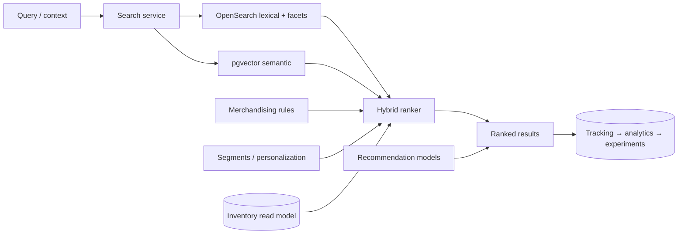

# 04 — Search & Recommendation Engine specification

> **Status: CONTRACT (Phase 1 — Platform) — 2026-06-28.** Enterprise search + recommendations. No
> application code. UI frozen ([`../ui/`](../ui/README.md)); storefront search/recs render via the
> block registry, and a merchandising-admin surface is **net-new and requires approval**.

## 1. Business goals

Help parents find the right developmental toy fast (age band, learning outcome, occasion) and raise
AOV/discovery through relevant, inventory-aware, personalized recommendations — all first-party,
measurable, and experimentable.

## 2. Architecture

Hybrid retrieval: **OpenSearch** (lexical + facets + typo/synonyms) + **pgvector embeddings**
(semantic / AI search), fused by a learned **ranker**; **merchandising rules** via the Rule Engine
([02](02-RULE_ENGINE_SPEC.md)); personalization via Customer 360 segments ([03](03-CUSTOMER_360_SPEC.md));
experiments via CRO ([growth 01](../growth/01-CRO_ENGINE_SPEC.md)); every interaction tracked
([arch 16](../architecture/16-tracking-specification.md)). Index fed via CDC from catalog/inventory.

### 2.1 Search capabilities
Autocomplete, suggestions, typo tolerance, synonyms, semantic search, AI search, category ranking,
product ranking, merchandising rules, pinned products, hidden products, faceted search, dynamic
filters, sorting rules, popularity ranking, inventory awareness, personalized search.

### 2.2 Recommendation capabilities
Frequently bought together, related products, recently viewed, trending, seasonal, recently
purchased, cross-sell, upsell, bundle suggestions — collaborative + content-based + ranking model,
served per surface and personalized by segment.

### 2.3 Analytics capabilities
Recommendation analytics, search analytics, zero-result analytics, search conversion rate,
click-through rate.

Mandatory integrations: every recommendation/search experience integrates with **Tracking,
Analytics, Experiments, Feature flags, Customer segments**.

## 3. Domain boundaries
**Search** context owns the index (read model); **Recommendations** context owns models/embeddings.
Both consume catalog/inventory/events; neither owns source product/stock data; no cross-context FK
([arch 03](../architecture/03-domain-and-database-boundaries.md)).

## 4. Database ownership
OpenSearch index + pgvector embeddings + model/feature store + ClickHouse (search/rec analytics).
Catalog/inventory remain the source of truth; the index is rebuildable from them.

## 5. Tracking
`search_submitted`, `search_results_viewed`, `search_result_clicked`, `search_no_results`,
`product_list_clicked`, `product_viewed` ([arch 16](../architecture/16-tracking-specification.md)); recommendation impressions + clicks carry the surface + model version.

## 6. Analytics
CTR, search→conversion, zero-result rate, recommendation attach rate, revenue per recommendation surface ([../analytics/01](../analytics/01-ANALYTICS_HUB_SPEC.md)).

## 7. Permissions
Merchandiser configures ranking/synonyms/pins/hides; analysts view; changes are role-gated + audited ([arch 07](../architecture/07-auth-and-authorization.md)).

## 8. Audit logs
Merchandising-rule, synonym, pin/hide, and ranking-config changes → `audit.entry.recorded` (WORM).

## 9. Feature flags
Ranking models, semantic search, AI search, and each recommendation surface are flaggable + experimentable ([growth 06](../growth/06-FEATURE_MANAGEMENT_SPEC.md), [arch 21](../architecture/21-experimentation-and-cro.md)).

## 10. Observability
Query latency, ranker stage timings, index lag, recall/precision proxies traced/measured ([arch 13](../architecture/13-observability.md)).

## 11. Performance
Target search p99 < 200ms, recs p99 < 150ms; results cached per (query, facets, segment) with event-driven purge; embeddings precomputed.

## 12. Security
Query input sanitized; no injection into the index; merchandising config behind permissions; rate-limited at the edge.

## 13. Privacy
Personalization uses consented signals only; **no child data** in models/personalization ([arch 14](../architecture/14-security.md)); anonymous users get non-personalized ranking.

## 14. Scalability
OpenSearch + recommendation service scale horizontally; index sharded; embedding refresh + model training run as batch jobs; CDC keeps the index near-real-time.

## 15. Failure recovery
Degrade gracefully: semantic/personalization failure → lexical/popularity ranking; index rebuildable from catalog via replay; recs fall back to non-personalized.

## 16. Monitoring
Alerts on latency regressions, zero-result spikes, index lag, and CTR/conversion drops.

## 17. Version history
Ranking models, synonym dictionaries, and merchandising rule sets versioned with rollback; results can reference the model version.

## 18. Extension points
Custom ranking signals, recommendation strategies, and synonym sources via the Plugin SDK ([05](05-PLUGIN_SDK_SPEC.md)).

## 19. Dependencies
Catalog, Inventory, Customer 360 (segments), Rule Engine (merchandising), CRO (experiments), Tracking/Analytics, ML infra (Python).

## 20. Cross references
[arch 03](../architecture/03-domain-and-database-boundaries.md), [arch 16](../architecture/16-tracking-specification.md), [arch 21](../architecture/21-experimentation-and-cro.md), [growth 01](../growth/01-CRO_ENGINE_SPEC.md), [growth 07](../growth/07-COMMERCE_MODULES_SPEC.md), [02](02-RULE_ENGINE_SPEC.md), [03](03-CUSTOMER_360_SPEC.md).

## 21. Risk analysis
| Risk | Mitigation |
|---|---|
| Irrelevant results hurt conversion | Offline relevance eval + online experiments + guardrails |
| Out-of-stock items ranked high | Inventory-aware ranking, real-time CDC |
| Personalization filter bubble | Diversity/exploration in ranker; non-personalized fallback |
| Index/source drift | Rebuild-from-source + lag monitoring |

## 22. Future roadmap
Conversational/AI search over the catalog, visual search, multimodal embeddings (image + age + outcome), reinforcement-learned ranking, real-time session personalization.

## Requires ADR to change

- The hybrid (lexical + semantic) retrieval + learned-ranker architecture, or the inventory-aware + graceful-degradation rules.
- The "no child data in personalization" rule, or introducing the merchandising-admin surface (also requires UI approval per [`../ui/`](../ui/README.md)).
