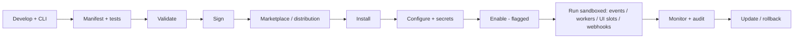

# 05 — Plugin SDK specification

> **Status: CONTRACT (Phase 1 — Platform) — 2026-06-28.** The extensibility platform. Extends the
> plugin model in [arch 11 — integration and plugins](../architecture/11-integration-and-plugins.md).
> No application code. UI frozen ([`../ui/`](../ui/README.md)): plugins may use only **declared**
> extension slots; any new admin surface (incl. a marketplace UI) **requires approval**.

## 1. Business goals

Let first- and third-party developers safely extend every part of the platform — new integrations,
channels, blocks, automation nodes, ranking signals — without forking core, and (later) monetize
through a marketplace. Extensibility is a competitive moat over closed platforms.

## 2. Architecture

Plugins are **sandboxed, signed, versioned packages** declaring a **manifest**. They attach only at
**declared extension points** via stable contracts (`packages/domain-events`, ports), run with
least-privilege scopes, and are isolated from core and from each other.

Capabilities: marketplace, lifecycle, manifest, permissions, events, APIs, UI extension points,
background workers, configuration, secrets, webhooks, CLI, testing, validation, sandboxing,
versioning, compatibility, dependencies, updates, rollback, monitoring, security, audit logs,
billing-ready, distribution, signing, isolation.

### 2.1 Manifest
Declares: id, version, compatibility range (platform API version), requested **permissions/scopes**,
**extension points** implemented, **config schema**, **secrets** required, **dependencies** (other
plugins/services), webhooks, background workers, and UI slot usage. Validated + signed before publish.

### 2.2 Lifecycle
Develop (CLI) → test → validate → sign → publish → install → configure → enable (behind a flag) →
run → monitor → update / rollback → disable/uninstall. Disable is instant and safe.

## 3. Extension points (across the platform)

Plugins attach only where a slot is declared. Admin UI slots are constrained by the frozen UI
contract ([`../ui/`](../ui/README.md)) — only existing declared slots; net-new admin surfaces require approval.

| Area | Extension points |
|---|---|
| Storefront | Page-builder blocks ([growth 02](../growth/02-PRODUCT_LAYOUT_BUILDER_SPEC.md)), theme components ([growth 08](../growth/08-THEME_DEVELOPER_SPEC.md)) |
| Admin dashboard | **Declared slots only** (frozen UI); new surfaces require approval |
| Checkout | Checkout steps/validators (rules via [02](02-RULE_ENGINE_SPEC.md)) |
| Tracking | Custom event types, destinations/CAPI sinks ([arch 09](../architecture/09-tracking-and-server-side-tracking.md)) |
| Analytics | Custom metrics, report sources ([../analytics/01](../analytics/01-ANALYTICS_HUB_SPEC.md)) |
| Automation | Custom triggers + action nodes ([01](01-WORKFLOW_AUTOMATION_ENGINE_SPEC.md)) |
| Feeds | Feed channels/formats ([arch 18](../architecture/18-product-feed-specification.md)) |
| Marketing | Message channels, segment providers ([arch 08](../architecture/08-marketing-core.md)) |
| Inventory / Orders / Shipping / Payments | Adapters behind ports (PSP, carrier, warehouse, fulfillment) ([arch 11](../architecture/11-integration-and-plugins.md)) |
| Customers | Timeline sources, scores/insights ([03](03-CUSTOMER_360_SPEC.md)) |
| Search / AI | Ranking signals, rec strategies, AI tools ([04](04-SEARCH_AND_RECOMMENDATION_ENGINE_SPEC.md), [growth 10](../growth/10-AI_CRO_ASSISTANT_SPEC.md)) |
| Notifications | Notification channels |
| CRM / ERP | Sync connectors ([growth 03](../growth/03-INTEGRATIONS_HUB_SPEC.md)) |

## 4. Domain boundaries
Plugins are tenants of the platform: they depend only on stable public contracts, never on a
context's internals; an event-subscriber plugin consumes asynchronously with its own DLQ and cannot
block the emitting transaction ([arch 11](../architecture/11-integration-and-plugins.md), [arch 03](../architecture/03-domain-and-database-boundaries.md)).

## 5. Database ownership
Each plugin gets an **isolated** namespace for its own state + config; it cannot read another
plugin's or a core context's data except through granted scoped APIs/events.

## 6. Tracking
Plugin install/enable/run/error emit operational events ([arch 16](../architecture/16-tracking-specification.md)).

## 7. Analytics
Per-plugin throughput, error rate, latency, and (billing) usage metering in ClickHouse.

## 8. Permissions
Plugins request scopes in the manifest; the installer grants explicitly (consent); a plugin can never
exceed its granted scopes ([arch 07](../architecture/07-auth-and-authorization.md)); admin install/manage is role-gated + step-up.

## 9. Audit logs
Install, enable/disable, config/secret change, scope grant, update, rollback → `audit.entry.recorded` (WORM, [arch 14](../architecture/14-security.md)).

## 10. Feature flags
Every plugin is flag-gated with an instant kill switch; staged rollout supported ([growth 06](../growth/06-FEATURE_MANAGEMENT_SPEC.md)).

## 11. Observability
Per-plugin traces/logs/metrics namespaced; failures isolated and attributed to the plugin ([arch 13](../architecture/13-observability.md)).

## 12. Performance
Resource quotas (CPU/memory/time) per plugin; UI extensions code-split + lazy; misbehaving plugins are throttled/auto-disabled without affecting core.

## 13. Security
**Signing** (verify publisher) + **sandboxing/isolation** (WASM or isolated runtime/process, no ambient FS/network), egress allowlist, secrets from Vault (never exposed to plugin code as plaintext beyond use), CSP for UI extensions, supply-chain scanning at publish ([arch 14](../architecture/14-security.md)).

## 14. Privacy
Plugins inherit consent + child-safety constraints; data access is scope-limited and audited; no plugin may exfiltrate PII or any child data.

## 15. Scalability
Background-worker plugins scale independently (isolated queues); marketplace + distribution served via CDN; runtime multi-tenant with per-tenant isolation.

## 16. Failure recovery
Plugin crash/timeout is contained (circuit-broken, auto-disabled); core continues; event-subscriber plugins use DLQ + replay; rollback to prior version is instant.

## 17. Monitoring
Per-plugin health dashboards + alerts (error rate, latency, quota breaches, repeated failures → auto-disable).

## 18. Version history
SemVer; compatibility range enforced at install/upgrade; immutable published versions; one-click rollback; staged updates.

## 19. Extension points (meta)
The SDK itself exposes the contract for registering new extension-point *types* (governed centrally, ADR-gated).

## 20. Dependencies
Event backbone, gateway (scoped plugin APIs), Vault, CLI/build tooling, marketplace/distribution, signing infrastructure, all extension-point host contexts.

## 21. Cross references
[arch 11](../architecture/11-integration-and-plugins.md), [arch 13](../architecture/13-observability.md), [arch 14](../architecture/14-security.md), [growth 03](../growth/03-INTEGRATIONS_HUB_SPEC.md), [growth 08](../growth/08-THEME_DEVELOPER_SPEC.md), [01](01-WORKFLOW_AUTOMATION_ENGINE_SPEC.md)–[04](04-SEARCH_AND_RECOMMENDATION_ENGINE_SPEC.md).

## 22. Risk analysis
| Risk | Mitigation |
|---|---|
| Malicious / vulnerable plugin | Signing, sandbox/isolation, scope limits, scanning, review |
| Plugin degrades core | Quotas, circuit breaker, auto-disable, isolation |
| Data exfiltration | Scoped APIs, egress allowlist, audit, no child/PII access |
| Breaking platform upgrade | Compatibility range, contract versioning, staged rollout |
| Plugin touches frozen admin UI | Declared slots only; new surfaces require approval |

## 23. Future roadmap
Public marketplace + revenue share (billing-ready hooks), plugin review/certification program, in-browser plugin dev sandbox, plugin templates per extension point, partner publisher portal.

## Requires ADR to change

- The sandbox/isolation + signing + scoped-permission model, or the "plugins depend only on stable public contracts" rule.
- The set of extension-point *types*, the manifest contract, or any extension point that exposes a new admin surface (also requires UI approval per [`../ui/`](../ui/README.md)).
